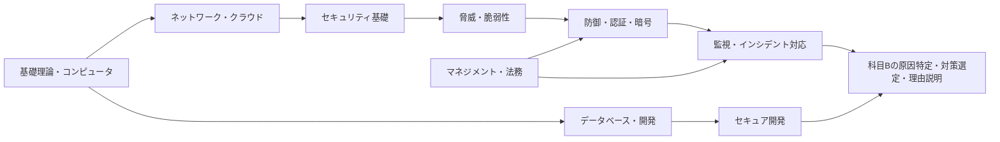

# 情報処理安全確保支援士試験 分野・用語マップ

このマップは、科目A-1の共通知識から科目A-2・科目Bの専門知識・技能へ進むための索引である。用語の説明は各リンク先のノートに委ね、ここでは概念上の位置、科目別の学習優先度、実質的に扱うノートだけを示す。

## 読み方と判定基準

- 列は `用語 | A-1 | A-2 | B | 出典` の順である。
- `★★★★★` が最優先、`★☆☆☆☆` が直接の出題対象内における低優先、`☆☆☆☆☆` が直接の出題対象外を表す。星は出題確率ではなく学習優先度である。
- A-1は中分類別出題数、重点分野、技術レベル、学習目標・用語例、A-2はセキュリティ17問、ネットワーク3問、その他5分野各1問という直近傾向、重点分野、技術レベル、学習目標を基準にした。
- Bは試験要綱の4業務、技能要求、ノートで出典が確認できる過去問実績、原因特定・ログ読解・対策選定・理由説明への利用度を基準にした。出題実績を確認していない用語について「出た」とは判定していない。
- 2026年度の現行資料として、ローカルの試験要綱 Ver.5.6、[応用情報技術者試験シラバス Ver.7.2](https://www.ipa.go.jp/shiken/syllabus/gaiyou.html)、[情報処理安全確保支援士試験シラバス Ver.2.1](https://www.ipa.go.jp/shiken/syllabus/gaiyou.html)、同追補版（科目A-2）Ver.4.0を参照した。2027年度向けシラバス案 Ver.0.1は判定根拠に含めていない。

## 1. コンピュータシステムの基礎

### 1.1 処理・記憶・入出力

| 用語 | A-1 | A-2 | B | 出典 |
|---|---|---|---|---|
| CPU、プロセッサ、PSW（プログラム状態語） | ★★☆☆☆ | ☆☆☆☆☆ | ☆☆☆☆☆ | [A-1・2.1・プロセッサ](A-1/2.1_プロセッサ.md) |
| CISC、RISC、VLIW | ★★☆☆☆ | ☆☆☆☆☆ | ☆☆☆☆☆ | [A-1・2.1・プロセッサ](A-1/2.1_プロセッサ.md) |
| パイプライン、スーパスカラ、パイプラインハザード | ★★☆☆☆ | ☆☆☆☆☆ | ☆☆☆☆☆ | [A-1・2.1・プロセッサ](A-1/2.1_プロセッサ.md) |
| ROM、RAM、SRAM、DRAM | ★★☆☆☆ | ☆☆☆☆☆ | ☆☆☆☆☆ | [A-1・2.2・メモリアーキテクチャ](A-1/2.2_メモリアーキテクチャ.md) |
| キャッシュメモリ、ライトスルー、ライトバック | ★★☆☆☆ | ☆☆☆☆☆ | ☆☆☆☆☆ | [A-1・2.2・メモリアーキテクチャ](A-1/2.2_メモリアーキテクチャ.md) |
| パリティ、ハミング符号、ECC（Error Correcting Code） | ★★☆☆☆ | ☆☆☆☆☆ | ☆☆☆☆☆ | [A-1・2.2・メモリアーキテクチャ](A-1/2.2_メモリアーキテクチャ.md) |
| RAID 0、RAID 1、RAID 5、RAID 6、RAID 10 | ★★☆☆☆ | ★☆☆☆☆ | ★★☆☆☆ | [A-1・2.3・入出力装置と入出力デバイス](A-1/2.3_入出力装置と入出力デバイス.md) |
| USB、SCSI、SATA、Bluetooth、NFC | ★☆☆☆☆ | ☆☆☆☆☆ | ☆☆☆☆☆ | [A-1・2.3・入出力装置と入出力デバイス](A-1/2.3_入出力装置と入出力デバイス.md) |
| SSD、光ディスク、オブジェクトストレージ | ★☆☆☆☆ | ☆☆☆☆☆ | ★☆☆☆☆ | [A-1・2.3・入出力装置と入出力デバイス](A-1/2.3_入出力装置と入出力デバイス.md) |
| DMA（Direct Memory Access）、デバイスドライバ、スプーリング | ★★☆☆☆ | ☆☆☆☆☆ | ☆☆☆☆☆ | [A-1・4.1・OSの基本機能](A-1/4.1_OSの基本機能.md) |
| プロセス、スレッド、プリエンプション、ラウンドロビン | ★★☆☆☆ | ☆☆☆☆☆ | ★☆☆☆☆ | [A-1・4.1・OSの基本機能](A-1/4.1_OSの基本機能.md) |
| 仮想記憶、ページング、ページフォールト、スラッシング | ★★☆☆☆ | ☆☆☆☆☆ | ★☆☆☆☆ | [A-1・4.2・記憶管理と同期・排他制御](A-1/4.2_記憶管理と同期・排他制御.md) |
| セマフォ、排他制御、クリティカルセクション、デッドロック | ★★☆☆☆ | ★☆☆☆☆ | ★★☆☆☆ | [A-1・4.2・記憶管理と同期・排他制御](A-1/4.2_記憶管理と同期・排他制御.md) |

### 1.2 構成・性能・信頼性・組込み

| 用語 | A-1 | A-2 | B | 出典 |
|---|---|---|---|---|
| クライアントサーバシステム、3層アーキテクチャ、RPC | ★★☆☆☆ | ★☆☆☆☆ | ★★☆☆☆ | [A-1・3.1・システム構成技術](A-1/3.1_システム構成技術.md) |
| フォールトトレランス、フォールトアボイダンス | ★★☆☆☆ | ★☆☆☆☆ | ★★★☆☆ | [A-1・3.1・システム構成技術](A-1/3.1_システム構成技術.md) |
| デュプレックスシステム、デュアルシステム、クラスタ | ★★☆☆☆ | ★☆☆☆☆ | ★★★☆☆ | [A-1・3.1・システム構成技術](A-1/3.1_システム構成技術.md) |
| 仮想マシン、ハイパーバイザ、VDI | ★★☆☆☆ | ★★☆☆☆ | ★★★☆☆ | [A-1・3.1・システム構成技術](A-1/3.1_システム構成技術.md) [A-2B・1.5・クラウドコンピューティングと仮想化技術](A-2B/1.5_クラウドコンピューティングと仮想化技術.md) |
| MIPS、CPI、TPS、SPEC、TPC | ★★☆☆☆ | ☆☆☆☆☆ | ☆☆☆☆☆ | [A-1・3.2・システムの性能・信頼性](A-1/3.2_システムの性能・信頼性.md) |
| RASIS、MTBF、MTTR、稼働率 | ★★☆☆☆ | ★☆☆☆☆ | ★★★☆☆ | [A-1・3.2・システムの性能・信頼性](A-1/3.2_システムの性能・信頼性.md) |
| フェールセーフ、フェールソフト、フールプルーフ | ★★☆☆☆ | ★☆☆☆☆ | ★★☆☆☆ | [A-1・3.2・システムの性能・信頼性](A-1/3.2_システムの性能・信頼性.md) |
| フェールオーバ、フェールバック、スケールアウト、スケールアップ | ★★☆☆☆ | ★☆☆☆☆ | ★★★☆☆ | [A-1・3.2・システムの性能・信頼性](A-1/3.2_システムの性能・信頼性.md) |
| マイコン、センサ、アクチュエータ | ★☆☆☆☆ | ☆☆☆☆☆ | ☆☆☆☆☆ | [A-1・4.3・ハードウェア（組込みシステム）](A-1/4.3_ハードウェア（組込みシステム）.md) |
| ASIC、FPGA、SoC（System on a Chip） | ★☆☆☆☆ | ☆☆☆☆☆ | ★☆☆☆☆ | [A-1・4.3・ハードウェア（組込みシステム）](A-1/4.3_ハードウェア（組込みシステム）.md) |
| 耐タンパ性、ウォッチドッグタイマ | ★☆☆☆☆ | ★☆☆☆☆ | ★★☆☆☆ | [A-1・4.3・ハードウェア（組込みシステム）](A-1/4.3_ハードウェア（組込みシステム）.md) |
| ユーザビリティ、アクセシビリティ、ユニバーサルデザイン | ★☆☆☆☆ | ☆☆☆☆☆ | ☆☆☆☆☆ | [A-1・5.1・ユーザーインタフェース](A-1/5.1_ユーザーインタフェース.md) |
| 入力チェック、レスポンシブWebデザイン | ★☆☆☆☆ | ★☆☆☆☆ | ★★☆☆☆ | [A-1・5.1・ユーザーインタフェース](A-1/5.1_ユーザーインタフェース.md) |
| JPEG、HEIF、H.264、H.265、MP3 | ★☆☆☆☆ | ☆☆☆☆☆ | ☆☆☆☆☆ | [A-1・5.2・マルチメディア](A-1/5.2_マルチメディア.md) |
| CG（Computer Graphics）、VR、AR | ★☆☆☆☆ | ☆☆☆☆☆ | ☆☆☆☆☆ | [A-1・5.2・マルチメディア](A-1/5.2_マルチメディア.md) |

## 2. データとデータベース

### 2.1 モデル・設計・操作

| 用語 | A-1 | A-2 | B | 出典 |
|---|---|---|---|---|
| 概念スキーマ、外部スキーマ、内部スキーマ | ★★★☆☆ | ★★☆☆☆ | ★☆☆☆☆ | [A-1・6.1・データベース方式と設計](A-1/6.1_データベース方式と設計.md) |
| E-Rモデル、エンティティ、リレーションシップ、カーディナリティ | ★★★☆☆ | ★★☆☆☆ | ★★☆☆☆ | [A-1・6.1・データベース方式と設計](A-1/6.1_データベース方式と設計.md) |
| 主キー、候補キー、外部キー、関数従属 | ★★★☆☆ | ★★☆☆☆ | ★★☆☆☆ | [A-1・6.1・データベース方式と設計](A-1/6.1_データベース方式と設計.md) |
| 第1正規形、第2正規形、第3正規形 | ★★★☆☆ | ★★☆☆☆ | ★★☆☆☆ | [A-1・6.1・データベース方式と設計](A-1/6.1_データベース方式と設計.md) |
| 関係代数、選択、射影、結合 | ★★★☆☆ | ★★☆☆☆ | ★☆☆☆☆ | [A-1・6.2・関係代数とデータベース言語](A-1/6.2_関係代数とデータベース言語.md) |
| SQL、DDL、DML、SELECT | ★★★☆☆ | ★★★☆☆ | ★★★☆☆ | [A-1・6.2・関係代数とデータベース言語](A-1/6.2_関係代数とデータベース言語.md) |
| GRANT、REVOKE | ★★★☆☆ | ★★★☆☆ | ★★★★☆ | [A-1・6.2・関係代数とデータベース言語](A-1/6.2_関係代数とデータベース言語.md) [A-2B・8.4・ECMAScriptの概要とプログラミング](A-2B/8.4_ECMAScriptの概要とプログラミング.md) |
| NoSQL、キー・バリュー型、ドキュメント指向 | ★★☆☆☆ | ★☆☆☆☆ | ★☆☆☆☆ | [A-1・6.1・データベース方式と設計](A-1/6.1_データベース方式と設計.md) |
| ビュー、インデックス、B+木 | ★★★☆☆ | ★★☆☆☆ | ★★☆☆☆ | [A-1・6.1・データベース方式と設計](A-1/6.1_データベース方式と設計.md) |
| DA（Data Administrator）、DBA（Database Administrator） | ★★☆☆☆ | ★★☆☆☆ | ★★☆☆☆ | [A-1・6.1・データベース方式と設計](A-1/6.1_データベース方式と設計.md) |

### 2.2 トランザクション・分析・資源管理

| 用語 | A-1 | A-2 | B | 出典 |
|---|---|---|---|---|
| ACID特性、共有ロック、占有ロック | ★★★☆☆ | ★★★☆☆ | ★★★☆☆ | [A-1・6.3・トランザクション処理](A-1/6.3_トランザクション処理.md) |
| WAL（Write Ahead Log）、チェックポイント、ロールバック、ロールフォワード | ★★★☆☆ | ★★☆☆☆ | ★★★☆☆ | [A-1・6.3・トランザクション処理](A-1/6.3_トランザクション処理.md) |
| RTO、RPO、RLO | ★★★☆☆ | ★★☆☆☆ | ★★★★☆ | [A-1・6.3・トランザクション処理](A-1/6.3_トランザクション処理.md) [A-2B・4.9・事業継続管理](A-2B/4.9_事業継続管理.md) |
| 2相コミット、レプリケーション、CAP定理 | ★★☆☆☆ | ★★☆☆☆ | ★★☆☆☆ | [A-1・6.3・トランザクション処理](A-1/6.3_トランザクション処理.md) |
| データウェアハウス、データマート、スタースキーマ | ★★☆☆☆ | ★☆☆☆☆ | ★☆☆☆☆ | [A-1・6.4・データベース応用](A-1/6.4_データベース応用.md) |
| OLAP、データマイニング、データクレンジング | ★★☆☆☆ | ★☆☆☆☆ | ★☆☆☆☆ | [A-1・6.4・データベース応用](A-1/6.4_データベース応用.md) |
| メタデータ、リポジトリ、データレイク | ★★☆☆☆ | ★☆☆☆☆ | ★★☆☆☆ | [A-1・6.4・データベース応用](A-1/6.4_データベース応用.md) |
| Hadoop | ★★☆☆☆ | ★☆☆☆☆ | ★☆☆☆☆ | [A-1・6.3・トランザクション処理](A-1/6.3_トランザクション処理.md) |
| データベース暗号化、透過的暗号化 | ★★☆☆☆ | ★★★★☆ | ★★★★☆ | [A-2B・7.1・暗号の基礎](A-2B/7.1_暗号の基礎.md) |
| データベース監査ログ | ★★☆☆☆ | ★★★★☆ | ★★★★★ | [A-2B・7.8・ログの分析及び管理](A-2B/7.8_ログの分析及び管理.md) |

## 3. ネットワーク・クラウド・利用環境

### 3.1 通信モデル・アドレス・経路

| 用語 | A-1 | A-2 | B | 出典 |
|---|---|---|---|---|
| OSI基本参照モデル、TCP/IPプロトコルスイート | ★★★☆☆ | ★★★★☆ | ★★★★☆ | [A-1・7.1・通信プロトコル](A-1/7.1_通信プロトコル.md) [A-2B・1.4・TCP/IPの主なプロトコルとネットワーク技術の基礎](A-2B/1.4_TCPIPの主なプロトコルとネットワーク技術の基礎.md) |
| IPv4、IPv6、IPアドレス、サブネットマスク | ★★★☆☆ | ★★★★☆ | ★★★★☆ | [A-1・7.1・通信プロトコル](A-1/7.1_通信プロトコル.md) [A-2B・1.4・TCP/IPの主なプロトコルとネットワーク技術の基礎](A-2B/1.4_TCPIPの主なプロトコルとネットワーク技術の基礎.md) |
| TCP、UDP、ポート番号、ソケット | ★★★☆☆ | ★★★★★ | ★★★★★ | [A-1・7.1・通信プロトコル](A-1/7.1_通信プロトコル.md) [A-2B・1.4・TCP/IPの主なプロトコルとネットワーク技術の基礎](A-2B/1.4_TCPIPの主なプロトコルとネットワーク技術の基礎.md) |
| ICMP、ARP、Ping | ★★★☆☆ | ★★★★☆ | ★★★★☆ | [A-1・7.1・通信プロトコル](A-1/7.1_通信プロトコル.md) [A-2B・1.4・TCP/IPの主なプロトコルとネットワーク技術の基礎](A-2B/1.4_TCPIPの主なプロトコルとネットワーク技術の基礎.md) |
| NAT、NAPT、CIDR | ★★★☆☆ | ★★★★☆ | ★★★★☆ | [A-1・7.3・ネットワーク](A-1/7.3_ネットワーク.md) [A-2B・1.4・TCP/IPの主なプロトコルとネットワーク技術の基礎](A-2B/1.4_TCPIPの主なプロトコルとネットワーク技術の基礎.md) |
| LAN、WAN、イーサネット、MACアドレス | ★★★☆☆ | ★★★★☆ | ★★★★☆ | [A-1・7.3・ネットワーク](A-1/7.3_ネットワーク.md) |
| ルータ、L2スイッチ、L3スイッチ、VLAN | ★★★☆☆ | ★★★★★ | ★★★★★ | [A-1・7.3・ネットワーク](A-1/7.3_ネットワーク.md) [A-2B・3.2・ネットワーク構成における脆弱性と対策](A-2B/3.2_ネットワーク構成における脆弱性と対策.md) |
| DHCP、DNS、リゾルバ | ★★★☆☆ | ★★★★★ | ★★★★★ | [A-1・7.3・ネットワーク](A-1/7.3_ネットワーク.md) [A-2B・3.5・DNSの脆弱性と対策](A-2B/3.5_DNSの脆弱性と対策.md) |
| PCM、変調、ビット同期、ブロック同期 | ★★☆☆☆ | ★☆☆☆☆ | ★☆☆☆☆ | [A-1・7.2・符号化と伝送](A-1/7.2_符号化と伝送.md) |
| CRC（Cyclic Redundancy Check）、LRC、VRC | ★★☆☆☆ | ★☆☆☆☆ | ★☆☆☆☆ | [A-1・7.2・符号化と伝送](A-1/7.2_符号化と伝送.md) |

### 3.2 サービス・無線・クラウド・境界再設計

| 用語 | A-1 | A-2 | B | 出典 |
|---|---|---|---|---|
| HTTP、HTTPS、SMTP、POP3、IMAP | ★★★☆☆ | ★★★★★ | ★★★★★ | [A-1・7.3・ネットワーク](A-1/7.3_ネットワーク.md) [A-2B・1.4・TCP/IPの主なプロトコルとネットワーク技術の基礎](A-2B/1.4_TCPIPの主なプロトコルとネットワーク技術の基礎.md) |
| IEEE 802.11、Wi-Fi、SSID、CSMA/CA | ★★★☆☆ | ★★★★☆ | ★★★★☆ | [A-1・7.3・ネットワーク](A-1/7.3_ネットワーク.md) [A-2B・7.6・無線LAN環境におけるセキュリティ](A-2B/7.6_無線LAN環境におけるセキュリティ.md) |
| SDN（Software-Defined Networking）、OpenFlow、NFV | ★★☆☆☆ | ★★★☆☆ | ★★★☆☆ | [A-1・7.4・ネットワーク応用](A-1/7.4_ネットワーク応用.md) |
| VoIP、LTE、5G、MVNO | ★★☆☆☆ | ★★☆☆☆ | ★★☆☆☆ | [A-1・7.4・ネットワーク応用](A-1/7.4_ネットワーク応用.md) |
| VPN、IP-VPN、インターネットVPN | ★★★☆☆ | ★★★★★ | ★★★★★ | [A-1・7.4・ネットワーク応用](A-1/7.4_ネットワーク応用.md) [A-2B・7.2・VPN](A-2B/7.2_VPN.md) |
| IaaS、PaaS、SaaS | ★★☆☆☆ | ★★★★☆ | ★★★★☆ | [A-2B・1.5・クラウドコンピューティングと仮想化技術](A-2B/1.5_クラウドコンピューティングと仮想化技術.md) |
| パブリッククラウド、プライベートクラウド、ハイブリッドクラウド | ★★☆☆☆ | ★★★★☆ | ★★★★☆ | [A-2B・1.5・クラウドコンピューティングと仮想化技術](A-2B/1.5_クラウドコンピューティングと仮想化技術.md) |
| 責任共有モデル、CASB（Cloud Access Security Broker）、CSPM | ★☆☆☆☆ | ★★★★☆ | ★★★★★ | [A-2B・1.5・クラウドコンピューティングと仮想化技術](A-2B/1.5_クラウドコンピューティングと仮想化技術.md) |
| テレワーク、VPN装置、リモートデスクトップ | ★☆☆☆☆ | ★★★★☆ | ★★★★★ | [A-2B・1.6・テレワークとセキュリティ](A-2B/1.6_テレワークとセキュリティ.md) |
| BYOD（Bring Your Own Device）、MDM（Mobile Device Management） | ★☆☆☆☆ | ★★★★☆ | ★★★★★ | [A-2B・1.6・テレワークとセキュリティ](A-2B/1.6_テレワークとセキュリティ.md) |
| ゼロトラスト、継続的検証 | ★★☆☆☆ | ★★★★★ | ★★★★★ | [A-2B・1.7・ゼロトラストとSASE](A-2B/1.7_ゼロトラストとSASE.md) |
| SASE（Secure Access Service Edge）、SSE（Security Service Edge）、SD-WAN | ★☆☆☆☆ | ★★★★☆ | ★★★★☆ | [A-2B・1.7・ゼロトラストとSASE](A-2B/1.7_ゼロトラストとSASE.md) |

## 4. セキュリティの原則と脅威モデル

### 4.1 守る特性・資産・統制

| 用語 | A-1 | A-2 | B | 出典 |
|---|---|---|---|---|
| CIA（機密性・完全性・可用性） | ★★★★★ | ★★★★★ | ★★★★★ | [A-1・8.2・情報セキュリティ管理](A-1/8.2_情報セキュリティ管理.md) [A-2B・1.1・情報セキュリティの概念](A-2B/1.1_情報セキュリティの概念.md) |
| 真正性、責任追跡性、否認防止、信頼性 | ★★★★☆ | ★★★★★ | ★★★★★ | [A-2B・1.1・情報セキュリティの概念](A-2B/1.1_情報セキュリティの概念.md) |
| 情報資産、脅威、脆弱性、リスク | ★★★★★ | ★★★★★ | ★★★★★ | [A-1・8.1・情報セキュリティ](A-1/8.1_情報セキュリティ.md) [A-2B・1.1・情報セキュリティの概念](A-2B/1.1_情報セキュリティの概念.md) |
| 多層防御、Defense in Depth | ★★★★☆ | ★★★★★ | ★★★★★ | [A-1・8.1・情報セキュリティ](A-1/8.1_情報セキュリティ.md) [A-2B・5.1・情報セキュリティ対策の全体像](A-2B/5.1_情報セキュリティ対策の全体像.md) |
| 抑止、予防、検知、回復 | ★★★☆☆ | ★★★★★ | ★★★★★ | [A-2B・1.2・情報セキュリティの特性と基本的な考え方](A-2B/1.2_情報セキュリティの特性と基本的な考え方.md) |
| 人的対策、物理的対策、技術的対策、組織的対策 | ★★★★☆ | ★★★★★ | ★★★★★ | [A-1・8.2・情報セキュリティ管理](A-1/8.2_情報セキュリティ管理.md) [A-2B・1.2・情報セキュリティの特性と基本的な考え方](A-2B/1.2_情報セキュリティの特性と基本的な考え方.md) |
| 最小権限、職務分離、Need to Know | ★★★★☆ | ★★★★★ | ★★★★★ | [A-2B・1.2・情報セキュリティの特性と基本的な考え方](A-2B/1.2_情報セキュリティの特性と基本的な考え方.md) |
| ISMS（Information Security Management System）、PDCA | ★★★★☆ | ★★★★★ | ★★★★★ | [A-1・8.2・情報セキュリティ管理](A-1/8.2_情報セキュリティ管理.md) [A-2B・1.3・情報セキュリティマネジメントの基礎](A-2B/1.3_情報セキュリティマネジメントの基礎.md) |
| ISO/IEC 27001、JIS Q 27001 | ★★★★☆ | ★★★★★ | ★★★★★ | [A-2B・1.3・情報セキュリティマネジメントの基礎](A-2B/1.3_情報セキュリティマネジメントの基礎.md) |
| CSIRT（Computer Security Incident Response Team）、SOC（Security Operation Center） | ★★★★☆ | ★★★★★ | ★★★★★ | [A-2B・1.3・情報セキュリティマネジメントの基礎](A-2B/1.3_情報セキュリティマネジメントの基礎.md) |

### 4.2 脅威・脆弱性・評価尺度

| 用語 | A-1 | A-2 | B | 出典 |
|---|---|---|---|---|
| 意図的脅威、偶発的脅威、環境的脅威 | ★★★★☆ | ★★★★★ | ★★★★★ | [A-2B・2.1・脅威の分類と概要](A-2B/2.1_脅威の分類と概要.md) |
| サイバー攻撃、内部不正、ソーシャルエンジニアリング | ★★★★★ | ★★★★★ | ★★★★★ | [A-1・8.1・情報セキュリティ](A-1/8.1_情報セキュリティ.md) [A-2B・2.1・脅威の分類と概要](A-2B/2.1_脅威の分類と概要.md) |
| STRIDE、Attack Tree、MITRE ATT&CK | ★★☆☆☆ | ★★★★☆ | ★★★★☆ | [A-2B・2.1・脅威の分類と概要](A-2B/2.1_脅威の分類と概要.md) |
| 脆弱性、設定不備、設計上の欠陥、実装上の欠陥 | ★★★★★ | ★★★★★ | ★★★★★ | [A-2B・3.1・脆弱性の概要](A-2B/3.1_脆弱性の概要.md) |
| CVE（Common Vulnerabilities and Exposures）、CWE（Common Weakness Enumeration） | ★★★☆☆ | ★★★★★ | ★★★★★ | [A-2B・3.1・脆弱性の概要](A-2B/3.1_脆弱性の概要.md) |
| CVSS（Common Vulnerability Scoring System） | ★★★★☆ | ★★★★★ | ★★★★★ | [A-2B・3.1・脆弱性の概要](A-2B/3.1_脆弱性の概要.md) |
| JVN（Japan Vulnerability Notes）、JVN iPedia | ★★★☆☆ | ★★★★☆ | ★★★★★ | [A-2B・3.1・脆弱性の概要](A-2B/3.1_脆弱性の概要.md) |
| ゼロデイ脆弱性、Nデイ脆弱性 | ★★★★☆ | ★★★★★ | ★★★★★ | [A-2B・3.1・脆弱性の概要](A-2B/3.1_脆弱性の概要.md) |
| サプライチェーンリスク、委託先リスク | ★★★★☆ | ★★★★★ | ★★★★★ | [A-2B・2.1・脅威の分類と概要](A-2B/2.1_脅威の分類と概要.md) [A-2B・4.2・リスクマネジメントとリスク対応](A-2B/4.2_リスクマネジメントとリスク対応.md) |
| セキュリティバイデザイン、プライバシーバイデザイン | ★★★☆☆ | ★★★★★ | ★★★★★ | [A-2B・8.1・システム開発工程とセキュリティ](A-2B/8.1_システム開発工程とセキュリティ.md) |

## 5. 攻撃手法とプロトコル上の弱点

### 5.1 探索・認証・セッション・サービス妨害

| 用語 | A-1 | A-2 | B | 出典 |
|---|---|---|---|---|
| ポートスキャン、TCPコネクトスキャン、SYNスキャン | ★★★☆☆ | ★★★★★ | ★★★★★ | [A-2B・2.2・ポートスキャン](A-2B/2.2_ポートスキャン.md) |
| OSフィンガープリンティング、バナーグラビング | ★★☆☆☆ | ★★★★☆ | ★★★★☆ | [A-2B・2.2・ポートスキャン](A-2B/2.2_ポートスキャン.md) |
| バッファオーバフロー、スタックオーバフロー | ★★★★☆ | ★★★★★ | ★★★★★ | [A-2B・2.3・バッファオーバフロー攻撃](A-2B/2.3_バッファオーバフロー攻撃.md) |
| ASLR、DEP、スタックカナリア | ★★★☆☆ | ★★★★★ | ★★★★★ | [A-2B・2.3・バッファオーバフロー攻撃](A-2B/2.3_バッファオーバフロー攻撃.md) |
| 総当たり攻撃、辞書攻撃、パスワードリスト攻撃 | ★★★★★ | ★★★★★ | ★★★★★ | [A-1・8.1・情報セキュリティ](A-1/8.1_情報セキュリティ.md) [A-2B・2.4・パスワードクラック](A-2B/2.4_パスワードクラック.md) |
| レインボーテーブル、ソルト、ストレッチング | ★★★★☆ | ★★★★★ | ★★★★★ | [A-2B・2.4・パスワードクラック](A-2B/2.4_パスワードクラック.md) |
| セッションハイジャック、セッションID固定化攻撃 | ★★★★☆ | ★★★★★ | ★★★★★ | [A-2B・2.5・セッションハイジャック](A-2B/2.5_セッションハイジャック.md) |
| リプレイ攻撃、中間者攻撃、MITM（Man-in-the-Middle） | ★★★★☆ | ★★★★★ | ★★★★★ | [A-2B・2.5・セッションハイジャック](A-2B/2.5_セッションハイジャック.md) |
| DoS、DDoS、DRDoS | ★★★★★ | ★★★★★ | ★★★★★ | [A-2B・2.7・DoS攻撃](A-2B/2.7_DoS攻撃.md) |
| SYN Flood、UDP Flood、Slow HTTP DoS | ★★★☆☆ | ★★★★★ | ★★★★★ | [A-2B・2.7・DoS攻撃](A-2B/2.7_DoS攻撃.md) |
| DNSアンプ攻撃、NTPアンプ攻撃 | ★★★☆☆ | ★★★★★ | ★★★★★ | [A-2B・2.7・DoS攻撃](A-2B/2.7_DoS攻撃.md) |

### 5.2 DNS・メール・Webアプリケーション

| 用語 | A-1 | A-2 | B | 出典 |
|---|---|---|---|---|
| DNSキャッシュポイズニング、カミンスキー攻撃 | ★★★★☆ | ★★★★★ | ★★★★★ | [A-2B・2.6・DNSサーバに対する攻撃](A-2B/2.6_DNSサーバに対する攻撃.md) [A-2B・3.5・DNSの脆弱性と対策](A-2B/3.5_DNSの脆弱性と対策.md) |
| DNSリフレクタ攻撃、オープンリゾルバ | ★★★☆☆ | ★★★★★ | ★★★★★ | [A-2B・2.6・DNSサーバに対する攻撃](A-2B/2.6_DNSサーバに対する攻撃.md) |
| DNSSEC（DNS Security Extensions）、送信元ポートランダム化 | ★★★☆☆ | ★★★★★ | ★★★★★ | [A-2B・3.5・DNSの脆弱性と対策](A-2B/3.5_DNSの脆弱性と対策.md) |
| メールヘッダインジェクション、SMTPオープンリレー | ★★★☆☆ | ★★★★★ | ★★★★★ | [A-2B・3.4・電子メールの脆弱性と対策](A-2B/3.4_電子メールの脆弱性と対策.md) |
| SPF、DKIM、DMARC | ★★★★☆ | ★★★★★ | ★★★★★ | [A-2B・3.4・電子メールの脆弱性と対策](A-2B/3.4_電子メールの脆弱性と対策.md) |
| XSS（Cross-Site Scripting）、反射型XSS、格納型XSS、DOM Based XSS | ★★★★★ | ★★★★★ | ★★★★★ | [A-2B・2.8・Webアプリケーションに不正なスクリプトや命令を実行させる攻撃](A-2B/2.8_Webアプリケーションに不正なスクリプトや命令を実行させる攻撃.md) [A-2B・3.6・HTTP及びWebアプリケーションの脆弱性と対策](A-2B/3.6_HTTP及びWebアプリケーションの脆弱性と対策.md) |
| SQLインジェクション、プレースホルダ、プリペアドステートメント | ★★★★★ | ★★★★★ | ★★★★★ | [A-2B・2.8・Webアプリケーションに不正なスクリプトや命令を実行させる攻撃](A-2B/2.8_Webアプリケーションに不正なスクリプトや命令を実行させる攻撃.md) [A-2B・3.6・HTTP及びWebアプリケーションの脆弱性と対策](A-2B/3.6_HTTP及びWebアプリケーションの脆弱性と対策.md) |
| OSコマンドインジェクション | ★★★★☆ | ★★★★★ | ★★★★★ | [A-2B・2.8・Webアプリケーションに不正なスクリプトや命令を実行させる攻撃](A-2B/2.8_Webアプリケーションに不正なスクリプトや命令を実行させる攻撃.md) |
| CSRF（Cross-Site Request Forgery）、CSRFトークン | ★★★★☆ | ★★★★★ | ★★★★★ | [A-2B・3.6・HTTP及びWebアプリケーションの脆弱性と対策](A-2B/3.6_HTTP及びWebアプリケーションの脆弱性と対策.md) |
| ディレクトリトラバーサル、パストラバーサル | ★★★★☆ | ★★★★★ | ★★★★★ | [A-2B・3.6・HTTP及びWebアプリケーションの脆弱性と対策](A-2B/3.6_HTTP及びWebアプリケーションの脆弱性と対策.md) |
| HTTPヘッダインジェクション、クリックジャッキング | ★★★☆☆ | ★★★★★ | ★★★★★ | [A-2B・3.6・HTTP及びWebアプリケーションの脆弱性と対策](A-2B/3.6_HTTP及びWebアプリケーションの脆弱性と対策.md) |
| Cookie、Secure属性、HttpOnly属性、SameSite属性 | ★★★☆☆ | ★★★★★ | ★★★★★ | [A-2B・3.6・HTTP及びWebアプリケーションの脆弱性と対策](A-2B/3.6_HTTP及びWebアプリケーションの脆弱性と対策.md) |

### 5.3 マルウェアとネットワーク固有の脆弱性

| 用語 | A-1 | A-2 | B | 出典 |
|---|---|---|---|---|
| コンピュータウイルス、ワーム、トロイの木馬 | ★★★★★ | ★★★★★ | ★★★★★ | [A-1・8.1・情報セキュリティ](A-1/8.1_情報セキュリティ.md) [A-2B・2.9・マルウェアによる攻撃](A-2B/2.9_マルウェアによる攻撃.md) |
| ランサムウェア、スパイウェア、キーロガー | ★★★★★ | ★★★★★ | ★★★★★ | [A-2B・2.9・マルウェアによる攻撃](A-2B/2.9_マルウェアによる攻撃.md) |
| ボット、ボットネット、C&Cサーバ | ★★★★☆ | ★★★★★ | ★★★★★ | [A-2B・2.9・マルウェアによる攻撃](A-2B/2.9_マルウェアによる攻撃.md) |
| ルートキット、バックドア、ファイルレスマルウェア | ★★★☆☆ | ★★★★★ | ★★★★★ | [A-2B・2.9・マルウェアによる攻撃](A-2B/2.9_マルウェアによる攻撃.md) |
| 標的型攻撃、APT（Advanced Persistent Threat） | ★★★★★ | ★★★★★ | ★★★★★ | [A-2B・2.9・マルウェアによる攻撃](A-2B/2.9_マルウェアによる攻撃.md) |
| VLANホッピング、ARPスプーフィング、MACアドレステーブルあふれ | ★★★☆☆ | ★★★★★ | ★★★★★ | [A-2B・3.2・ネットワーク構成における脆弱性と対策](A-2B/3.2_ネットワーク構成における脆弱性と対策.md) |
| DHCPスプーフィング、DHCPスヌーピング、Dynamic ARP Inspection | ★★☆☆☆ | ★★★★☆ | ★★★★★ | [A-2B・3.2・ネットワーク構成における脆弱性と対策](A-2B/3.2_ネットワーク構成における脆弱性と対策.md) |
| IPスプーフィング、TCPシーケンス番号予測攻撃 | ★★★☆☆ | ★★★★★ | ★★★★★ | [A-2B・3.3・TCP/IPプロトコル全般における共通の脆弱性への対策](A-2B/3.3_TCPIPプロトコル全般における共通の脆弱性への対策.md) |
| Smurf攻撃、ICMP Redirect攻撃 | ★★☆☆☆ | ★★★★☆ | ★★★★☆ | [A-2B・3.3・TCP/IPプロトコル全般における共通の脆弱性への対策](A-2B/3.3_TCPIPプロトコル全般における共通の脆弱性への対策.md) |
| ingress filtering、egress filtering、BCP 38 | ★★☆☆☆ | ★★★★☆ | ★★★★★ | [A-2B・3.3・TCP/IPプロトコル全般における共通の脆弱性への対策](A-2B/3.3_TCPIPプロトコル全般における共通の脆弱性への対策.md) |

## 6. 検査・境界防御・実行環境防御

### 6.1 要塞化・診断・検知・遮断

| 用語 | A-1 | A-2 | B | 出典 |
|---|---|---|---|---|
| ハードニング、要塞化、不要サービス停止、パッチ適用 | ★★★★☆ | ★★★★★ | ★★★★★ | [A-2B・5.2・ホストの要塞化](A-2B/5.2_ホストの要塞化.md) |
| セキュアベースライン、構成管理 | ★★★☆☆ | ★★★★★ | ★★★★★ | [A-2B・5.2・ホストの要塞化](A-2B/5.2_ホストの要塞化.md) |
| 脆弱性スキャン、脆弱性診断、ペネトレーションテスト | ★★★★☆ | ★★★★★ | ★★★★★ | [A-2B・5.3・脆弱性診断](A-2B/5.3_脆弱性診断.md) |
| プラットフォーム診断、Webアプリケーション診断 | ★★★☆☆ | ★★★★☆ | ★★★★★ | [A-2B・5.3・脆弱性診断](A-2B/5.3_脆弱性診断.md) |
| Trusted OS、TCB（Trusted Computing Base）、リファレンスモニタ | ★★☆☆☆ | ★★★★☆ | ★★★★☆ | [A-2B・5.4・Trusted OS](A-2B/5.4_Trusted OS.md) |
| セキュリティカーネル、完全仲介 | ★★☆☆☆ | ★★★★☆ | ★★★★☆ | [A-2B・5.4・Trusted OS](A-2B/5.4_Trusted OS.md) |
| ファイアウォール、パケットフィルタリング、ステートフルインスペクション | ★★★★★ | ★★★★★ | ★★★★★ | [A-1・8.1・情報セキュリティ](A-1/8.1_情報セキュリティ.md) [A-2B・5.5・ファイアウォール](A-2B/5.5_ファイアウォール.md) |
| プロキシサーバ、アプリケーションゲートウェイ、DMZ | ★★★★☆ | ★★★★★ | ★★★★★ | [A-2B・5.5・ファイアウォール](A-2B/5.5_ファイアウォール.md) |
| IDS（Intrusion Detection System）、NIDS、HIDS | ★★★★★ | ★★★★★ | ★★★★★ | [A-2B・5.6・侵入検知システム（IDS）](A-2B/5.6_侵入検知システム%28IDS%29.md) |
| シグネチャ型検知、アノマリ型検知、誤検知、見逃し | ★★★★☆ | ★★★★★ | ★★★★★ | [A-2B・5.6・侵入検知システム（IDS）](A-2B/5.6_侵入検知システム%28IDS%29.md) |
| IPS（Intrusion Prevention System）、インラインモード | ★★★★★ | ★★★★★ | ★★★★★ | [A-2B・5.7・侵入防御システム（IPS）](A-2B/5.7_侵入防御システム%28IPS%29.md) |
| WAF（Web Application Firewall）、仮想パッチ | ★★★★★ | ★★★★★ | ★★★★★ | [A-2B・5.8・Webアプリケーションファイアウォール](A-2B/5.8_Webアプリケーションファイアウォール.md) |
| サンドボックス、動的解析、振る舞い検知 | ★★★★☆ | ★★★★★ | ★★★★★ | [A-2B・5.9・サンドボックス](A-2B/5.9_サンドボックス.md) |
| EDR（Endpoint Detection and Response）、XDR（Extended Detection and Response） | ★★★☆☆ | ★★★★★ | ★★★★★ | [A-2B・5.1・情報セキュリティ対策の全体像](A-2B/5.1_情報セキュリティ対策の全体像.md) |

## 7. アクセス制御・認証・ID連携

### 7.1 認可モデルと本人認証

| 用語 | A-1 | A-2 | B | 出典 |
|---|---|---|---|---|
| 識別、認証、認可、アカウンティング | ★★★★☆ | ★★★★★ | ★★★★★ | [A-2B・6.1・アクセス制御](A-2B/6.1_アクセス制御.md) |
| DAC（Discretionary Access Control）、MAC（Mandatory Access Control） | ★★★☆☆ | ★★★★★ | ★★★★★ | [A-2B・6.1・アクセス制御](A-2B/6.1_アクセス制御.md) |
| RBAC（Role-Based Access Control）、ABAC（Attribute-Based Access Control） | ★★★★☆ | ★★★★★ | ★★★★★ | [A-2B・6.1・アクセス制御](A-2B/6.1_アクセス制御.md) |
| ACL（Access Control List）、ケイパビリティ | ★★★☆☆ | ★★★★☆ | ★★★★☆ | [A-2B・6.1・アクセス制御](A-2B/6.1_アクセス制御.md) |
| 知識認証、所有物認証、生体認証 | ★★★★★ | ★★★★★ | ★★★★★ | [A-2B・6.2・認証の基礎](A-2B/6.2_認証の基礎.md) |
| 多要素認証、MFA（Multi-Factor Authentication）、多段階認証 | ★★★★★ | ★★★★★ | ★★★★★ | [A-2B・6.2・認証の基礎](A-2B/6.2_認証の基礎.md) |
| 本人拒否率、他人受入率、FRR、FAR、EER | ★★★☆☆ | ★★★★★ | ★★★★☆ | [A-2B・6.5・バイオメトリクスによる本人認証](A-2B/6.5_バイオメトリクスによる本人認証.md) |
| 指紋認証、虹彩認証、静脈認証、顔認証 | ★★★★☆ | ★★★★★ | ★★★★☆ | [A-2B・6.5・バイオメトリクスによる本人認証](A-2B/6.5_バイオメトリクスによる本人認証.md) |
| パスワードポリシ、アカウントロック | ★★★★★ | ★★★★★ | ★★★★★ | [A-2B・6.3・固定式パスワードによる認証](A-2B/6.3_固定式パスワードによる認証.md) |
| パスワード強度、パスフレーズ、定期変更 | ★★★★☆ | ★★★★★ | ★★★★★ | [A-2B・6.3・固定式パスワードによる認証](A-2B/6.3_固定式パスワードによる認証.md) |
| OTP（One-Time Password）、時刻同期方式、チャレンジレスポンス方式 | ★★★★★ | ★★★★★ | ★★★★★ | [A-2B・6.4・ワンタイムパスワード方式による認証](A-2B/6.4_ワンタイムパスワード方式による認証.md) |
| HOTP、TOTP | ★★★☆☆ | ★★★★★ | ★★★★★ | [A-2B・6.4・ワンタイムパスワード方式による認証](A-2B/6.4_ワンタイムパスワード方式による認証.md) |

### 7.2 認証基盤・カード・シングルサインオン・連携

| 用語 | A-1 | A-2 | B | 出典 |
|---|---|---|---|---|
| ICカード、接触型、非接触型 | ★★★☆☆ | ★★★★☆ | ★★★★☆ | [A-2B・6.6・ICカードによる本人認証](A-2B/6.6_ICカードによる本人認証.md) |
| PKCS#11、FeliCa | ★★☆☆☆ | ★★★☆☆ | ★★★☆☆ | [A-2B・6.6・ICカードによる本人認証](A-2B/6.6_ICカードによる本人認証.md) |
| RADIUS、TACACS+ | ★★★☆☆ | ★★★★★ | ★★★★★ | [A-2B・6.7・認証システムを実現する様々な技術](A-2B/6.7_認証システムを実現する様々な技術.md) |
| LDAP（Lightweight Directory Access Protocol）、ディレクトリサービス | ★★★☆☆ | ★★★★★ | ★★★★★ | [A-2B・6.7・認証システムを実現する様々な技術](A-2B/6.7_認証システムを実現する様々な技術.md) |
| Kerberos、KDC（Key Distribution Center）、TGT（Ticket Granting Ticket） | ★★★☆☆ | ★★★★★ | ★★★★★ | [A-2B・6.7・認証システムを実現する様々な技術](A-2B/6.7_認証システムを実現する様々な技術.md) |
| IEEE 802.1X、EAP（Extensible Authentication Protocol） | ★★★★☆ | ★★★★★ | ★★★★★ | [A-2B・6.7・認証システムを実現する様々な技術](A-2B/6.7_認証システムを実現する様々な技術.md) |
| SSO（Single Sign-On）、エージェント方式、リバースプロキシ方式 | ★★★★☆ | ★★★★★ | ★★★★★ | [A-2B・6.8・シングルサインオンによる認証](A-2B/6.8_シングルサインオンによる認証.md) |
| フォームベース認証、統合Windows認証 | ★★★☆☆ | ★★★★☆ | ★★★★☆ | [A-2B・6.8・シングルサインオンによる認証](A-2B/6.8_シングルサインオンによる認証.md) |
| フェデレーション、IdP（Identity Provider）、SP（Service Provider） | ★★★☆☆ | ★★★★★ | ★★★★★ | [A-2B・6.9・ID連携技術](A-2B/6.9_ID連携技術.md) |
| SAML（Security Assertion Markup Language） | ★★★☆☆ | ★★★★★ | ★★★★★ | [A-2B・6.9・ID連携技術](A-2B/6.9_ID連携技術.md) |
| OAuth 2.0、アクセストークン、認可コード | ★★★★☆ | ★★★★★ | ★★★★★ | [A-2B・6.9・ID連携技術](A-2B/6.9_ID連携技術.md) |
| OpenID Connect、IDトークン、JWT（JSON Web Token） | ★★★☆☆ | ★★★★★ | ★★★★★ | [A-2B・6.9・ID連携技術](A-2B/6.9_ID連携技術.md) |

## 8. 暗号・電子署名・安全な通信

### 8.1 暗号プリミティブと鍵管理

| 用語 | A-1 | A-2 | B | 出典 |
|---|---|---|---|---|
| 共通鍵暗号、秘密鍵暗号 | ★★★★★ | ★★★★★ | ★★★★★ | [A-1・8.1・情報セキュリティ](A-1/8.1_情報セキュリティ.md) [A-2B・7.1・暗号の基礎](A-2B/7.1_暗号の基礎.md) |
| AES（Advanced Encryption Standard）、Camellia | ★★★★☆ | ★★★★★ | ★★★★★ | [A-2B・7.1・暗号の基礎](A-2B/7.1_暗号の基礎.md) |
| 公開鍵暗号、RSA、楕円曲線暗号 | ★★★★★ | ★★★★★ | ★★★★★ | [A-1・8.1・情報セキュリティ](A-1/8.1_情報セキュリティ.md) [A-2B・7.1・暗号の基礎](A-2B/7.1_暗号の基礎.md) |
| ハイブリッド暗号、セッション鍵 | ★★★★☆ | ★★★★★ | ★★★★★ | [A-2B・7.1・暗号の基礎](A-2B/7.1_暗号の基礎.md) |
| ハッシュ関数、SHA-2、SHA-3 | ★★★★★ | ★★★★★ | ★★★★★ | [A-2B・7.1・暗号の基礎](A-2B/7.1_暗号の基礎.md) |
| MAC（Message Authentication Code）、HMAC、CMAC | ★★★★☆ | ★★★★★ | ★★★★★ | [A-2B・7.1・暗号の基礎](A-2B/7.1_暗号の基礎.md) |
| 電子署名、デジタル署名、署名検証 | ★★★★★ | ★★★★★ | ★★★★★ | [A-2B・7.1・暗号の基礎](A-2B/7.1_暗号の基礎.md) |
| DH（Diffie-Hellman）鍵交換、ECDH | ★★★☆☆ | ★★★★★ | ★★★★★ | [A-2B・7.1・暗号の基礎](A-2B/7.1_暗号の基礎.md) |
| 鍵生成、鍵配送、鍵保管、鍵更新、鍵失効、鍵廃棄 | ★★★★☆ | ★★★★★ | ★★★★★ | [A-2B・7.1・暗号の基礎](A-2B/7.1_暗号の基礎.md) |
| HSM（Hardware Security Module）、KMS（Key Management System） | ★★★☆☆ | ★★★★★ | ★★★★★ | [A-2B・7.1・暗号の基礎](A-2B/7.1_暗号の基礎.md) |

### 8.2 VPN・IPsec・TLS・メール・無線LAN

| 用語 | A-1 | A-2 | B | 出典 |
|---|---|---|---|---|
| トンネリング、カプセル化、L2TP、PPTP | ★★★☆☆ | ★★★★☆ | ★★★★☆ | [A-2B・7.2・VPN](A-2B/7.2_VPN.md) |
| IPsec、AH（Authentication Header）、ESP（Encapsulating Security Payload） | ★★★★★ | ★★★★★ | ★★★★★ | [A-2B・7.3・IPsec](A-2B/7.3_IPsec.md) |
| トランスポートモード、トンネルモード、SA（Security Association） | ★★★★☆ | ★★★★★ | ★★★★★ | [A-2B・7.3・IPsec](A-2B/7.3_IPsec.md) |
| IKE（Internet Key Exchange）、IKEv2 | ★★★★☆ | ★★★★★ | ★★★★★ | [A-2B・7.3・IPsec](A-2B/7.3_IPsec.md) |
| TLS（Transport Layer Security）、TLSハンドシェイク | ★★★★★ | ★★★★★ | ★★★★★ | [A-2B・7.4・SSL/TLS](A-2B/7.4_SSLTLS.md) |
| 暗号スイート、前方秘匿性、PFS（Perfect Forward Secrecy） | ★★★☆☆ | ★★★★★ | ★★★★★ | [A-2B・7.4・SSL/TLS](A-2B/7.4_SSLTLS.md) |
| S/MIME、PGP（Pretty Good Privacy） | ★★★★☆ | ★★★★★ | ★★★★★ | [A-2B・7.5・その他の主なセキュア通信技術](A-2B/7.5_その他の主なセキュア通信技術.md) |
| SSH（Secure Shell）、SFTP、SCP | ★★★★☆ | ★★★★★ | ★★★★★ | [A-2B・7.5・その他の主なセキュア通信技術](A-2B/7.5_その他の主なセキュア通信技術.md) |
| WEP、WPA、WPA2、WPA3 | ★★★★★ | ★★★★★ | ★★★★★ | [A-2B・7.6・無線LAN環境におけるセキュリティ](A-2B/7.6_無線LAN環境におけるセキュリティ.md) |
| PSK（Pre-Shared Key）、WPA-Enterprise、SAE（Simultaneous Authentication of Equals） | ★★★★☆ | ★★★★★ | ★★★★★ | [A-2B・7.6・無線LAN環境におけるセキュリティ](A-2B/7.6_無線LAN環境におけるセキュリティ.md) |
| Evil Twin、無線LAN不正アクセスポイント | ★★★☆☆ | ★★★★★ | ★★★★★ | [A-2B・7.6・無線LAN環境におけるセキュリティ](A-2B/7.6_無線LAN環境におけるセキュリティ.md) |

### 8.3 PKIと証明書

| 用語 | A-1 | A-2 | B | 出典 |
|---|---|---|---|---|
| PKI（Public Key Infrastructure）、CA（Certification Authority）、RA（Registration Authority） | ★★★★★ | ★★★★★ | ★★★★★ | [A-1・8.1・情報セキュリティ](A-1/8.1_情報セキュリティ.md) [A-2B・7.7・PKI](A-2B/7.7_PKI.md) |
| X.509公開鍵証明書、ルート証明書、中間CA証明書 | ★★★★☆ | ★★★★★ | ★★★★★ | [A-2B・7.7・PKI](A-2B/7.7_PKI.md) |
| 証明書チェーン、パス検証、トラストアンカー | ★★★★☆ | ★★★★★ | ★★★★★ | [A-2B・7.7・PKI](A-2B/7.7_PKI.md) |
| CRL（Certificate Revocation List）、OCSP（Online Certificate Status Protocol） | ★★★★☆ | ★★★★★ | ★★★★★ | [A-2B・7.7・PKI](A-2B/7.7_PKI.md) |
| EV証明書、ドメイン認証、組織認証 | ★★★☆☆ | ★★★★☆ | ★★★★☆ | [A-2B・7.7・PKI](A-2B/7.7_PKI.md) |
| 政府認証基盤、GPKI（Government Public Key Infrastructure） | ★★★☆☆ | ★★★★☆ | ★★★☆☆ | [A-2B・7.7・PKI](A-2B/7.7_PKI.md) |
| タイムスタンプ、TSA（Time-Stamping Authority）、タイムスタンプトークン | ★★★☆☆ | ★★★★☆ | ★★★★☆ | [A-2B・9.5・電子文書に関する法令及びタイムビジネス関係](A-2B/9.5_電子文書に関する法令及びタイムビジネス関係.md) |
| 長期署名、署名タイムスタンプ、保管タイムスタンプ | ★★☆☆☆ | ★★★☆☆ | ★★★★☆ | [A-2B・9.5・電子文書に関する法令及びタイムビジネス関係](A-2B/9.5_電子文書に関する法令及びタイムビジネス関係.md) |
| 電子署名法、認定認証事業者 | ★★★☆☆ | ★★★★☆ | ★★★★☆ | [A-2B・9.3・情報セキュリティに関する法律とガイドライン](A-2B/9.3_情報セキュリティに関する法律とガイドライン.md) [A-2B・9.5・電子文書に関する法令及びタイムビジネス関係](A-2B/9.5_電子文書に関する法令及びタイムビジネス関係.md) |
| 電子帳簿保存法、e-文書法 | ★★☆☆☆ | ★★★☆☆ | ★★★☆☆ | [A-2B・9.5・電子文書に関する法令及びタイムビジネス関係](A-2B/9.5_電子文書に関する法令及びタイムビジネス関係.md) |

## 9. ログ・可用性・インシデント対応

### 9.1 監視・分析・証拠保全

| 用語 | A-1 | A-2 | B | 出典 |
|---|---|---|---|---|
| システムログ、アクセスログ、認証ログ、監査ログ | ★★★★☆ | ★★★★★ | ★★★★★ | [A-2B・7.8・ログの分析及び管理](A-2B/7.8_ログの分析及び管理.md) |
| syslog、Windowsイベントログ | ★★★☆☆ | ★★★★★ | ★★★★★ | [A-2B・7.8・ログの分析及び管理](A-2B/7.8_ログの分析及び管理.md) |
| NTP（Network Time Protocol）、時刻同期 | ★★★☆☆ | ★★★★★ | ★★★★★ | [A-2B・7.8・ログの分析及び管理](A-2B/7.8_ログの分析及び管理.md) |
| SIEM（Security Information and Event Management）、相関分析 | ★★★★☆ | ★★★★★ | ★★★★★ | [A-2B・7.8・ログの分析及び管理](A-2B/7.8_ログの分析及び管理.md) |
| ログローテーション、改ざん防止、保存期間 | ★★★☆☆ | ★★★★★ | ★★★★★ | [A-2B・7.8・ログの分析及び管理](A-2B/7.8_ログの分析及び管理.md) |
| デジタルフォレンジックス、証拠保全 | ★★★★☆ | ★★★★★ | ★★★★★ | [A-1・8.1・情報セキュリティ](A-1/8.1_情報セキュリティ.md) [A-2B・4.8・情報セキュリティインシデント管理](A-2B/4.8_情報セキュリティインシデント管理.md) |
| 揮発性情報、ディスクイメージ、ハッシュ値 | ★★★☆☆ | ★★★★★ | ★★★★★ | [A-2B・4.8・情報セキュリティインシデント管理](A-2B/4.8_情報セキュリティインシデント管理.md) |
| Chain of Custody、証拠保管の連鎖 | ★★☆☆☆ | ★★★★☆ | ★★★★★ | [A-2B・4.8・情報セキュリティインシデント管理](A-2B/4.8_情報セキュリティインシデント管理.md) |
| IOC（Indicator of Compromise）、侵害指標 | ★★★☆☆ | ★★★★★ | ★★★★★ | [A-2B・4.8・情報セキュリティインシデント管理](A-2B/4.8_情報セキュリティインシデント管理.md) |
| SOAR（Security Orchestration, Automation and Response） | ★★☆☆☆ | ★★★★☆ | ★★★★☆ | [A-2B・7.8・ログの分析及び管理](A-2B/7.8_ログの分析及び管理.md) |

### 9.2 可用性・継続・復旧

| 用語 | A-1 | A-2 | B | 出典 |
|---|---|---|---|---|
| 冗長化、負荷分散、ロードバランサ | ★★★☆☆ | ★★★★☆ | ★★★★★ | [A-2B・7.9・可用性対策](A-2B/7.9_可用性対策.md) |
| ホットスタンバイ、ウォームスタンバイ、コールドスタンバイ | ★★★☆☆ | ★★★★☆ | ★★★★★ | [A-2B・7.9・可用性対策](A-2B/7.9_可用性対策.md) |
| バックアップ、フルバックアップ、差分バックアップ、増分バックアップ | ★★★★☆ | ★★★★★ | ★★★★★ | [A-2B・7.9・可用性対策](A-2B/7.9_可用性対策.md) |
| 3-2-1ルール、オフラインバックアップ、イミュータブルバックアップ | ★★★☆☆ | ★★★★★ | ★★★★★ | [A-2B・7.9・可用性対策](A-2B/7.9_可用性対策.md) |
| BCM（Business Continuity Management）、BCP（Business Continuity Plan） | ★★★★☆ | ★★★★☆ | ★★★★★ | [A-2B・4.9・事業継続管理](A-2B/4.9_事業継続管理.md) |
| BIA（Business Impact Analysis）、MTPD（Maximum Tolerable Period of Disruption） | ★★★☆☆ | ★★★★☆ | ★★★★★ | [A-2B・4.9・事業継続管理](A-2B/4.9_事業継続管理.md) |
| DR（Disaster Recovery）、代替サイト | ★★★☆☆ | ★★★★☆ | ★★★★★ | [A-2B・4.9・事業継続管理](A-2B/4.9_事業継続管理.md) |
| インシデント対応、検知、封じ込め、根絶、復旧 | ★★★★☆ | ★★★★★ | ★★★★★ | [A-2B・4.8・情報セキュリティインシデント管理](A-2B/4.8_情報セキュリティインシデント管理.md) |
| エスカレーション、危機広報、届出・報告 | ★★★☆☆ | ★★★★★ | ★★★★★ | [A-2B・4.8・情報セキュリティインシデント管理](A-2B/4.8_情報セキュリティインシデント管理.md) |
| 再発防止、教訓、事後レビュー | ★★★☆☆ | ★★★★☆ | ★★★★★ | [A-2B・4.8・情報セキュリティインシデント管理](A-2B/4.8_情報セキュリティインシデント管理.md) |

## 10. リスク・組織・人的物理的対策・監査

### 10.1 リスクアセスメントと方針

| 用語 | A-1 | A-2 | B | 出典 |
|---|---|---|---|---|
| リスク特定、リスク分析、リスク評価 | ★★★★☆ | ★★★★★ | ★★★★★ | [A-2B・4.1・リスクの概念とリスクアセスメント](A-2B/4.1_リスクの概念とリスクアセスメント.md) |
| 定性的リスク分析、定量的リスク分析 | ★★★★☆ | ★★★★★ | ★★★★★ | [A-2B・4.1・リスクの概念とリスクアセスメント](A-2B/4.1_リスクの概念とリスクアセスメント.md) |
| 資産価値、脅威、脆弱性、発生可能性、影響度 | ★★★★★ | ★★★★★ | ★★★★★ | [A-2B・4.1・リスクの概念とリスクアセスメント](A-2B/4.1_リスクの概念とリスクアセスメント.md) |
| リスク回避、リスク低減、リスク移転、リスク保有 | ★★★★☆ | ★★★★★ | ★★★★★ | [A-2B・4.2・リスクマネジメントとリスク対応](A-2B/4.2_リスクマネジメントとリスク対応.md) |
| リスク受容基準、残留リスク、リスク所有者 | ★★★☆☆ | ★★★★★ | ★★★★★ | [A-2B・4.2・リスクマネジメントとリスク対応](A-2B/4.2_リスクマネジメントとリスク対応.md) |
| リスク登録簿、リスク対応計画 | ★★★☆☆ | ★★★★☆ | ★★★★★ | [A-2B・4.2・リスクマネジメントとリスク対応](A-2B/4.2_リスクマネジメントとリスク対応.md) |
| 情報セキュリティ基本方針、対策基準、実施手順 | ★★★★☆ | ★★★★★ | ★★★★★ | [A-2B・4.3・情報セキュリティポリシの策定](A-2B/4.3_情報セキュリティポリシの策定.md) |
| 適用宣言書、SoA（Statement of Applicability） | ★★★☆☆ | ★★★★★ | ★★★★★ | [A-2B・4.3・情報セキュリティポリシの策定](A-2B/4.3_情報セキュリティポリシの策定.md) |
| KRI（Key Risk Indicator） | ★★☆☆☆ | ★★★★☆ | ★★★★☆ | [A-2B・4.3・情報セキュリティポリシの策定](A-2B/4.3_情報セキュリティポリシの策定.md) |
| 情報セキュリティ委員会、CISO（Chief Information Security Officer） | ★★★☆☆ | ★★★★★ | ★★★★★ | [A-2B・4.4・情報セキュリティのための組織](A-2B/4.4_情報セキュリティのための組織.md) |

### 10.2 資産・クライアント・物理・人的対策

| 用語 | A-1 | A-2 | B | 出典 |
|---|---|---|---|---|
| 情報資産台帳、情報分類、ラベリング | ★★★★☆ | ★★★★★ | ★★★★★ | [A-2B・4.5・情報資産の管理及びクライアントPCのセキュリティ](A-2B/4.5_情報資産の管理及びクライアントPCのセキュリティ.md) |
| 資産管理、ライフサイクル管理、媒体廃棄 | ★★★☆☆ | ★★★★★ | ★★★★★ | [A-2B・4.5・情報資産の管理及びクライアントPCのセキュリティ](A-2B/4.5_情報資産の管理及びクライアントPCのセキュリティ.md) |
| クライアントPC、マルウェア対策、パッチ管理、デバイス制御 | ★★★★☆ | ★★★★★ | ★★★★★ | [A-2B・4.5・情報資産の管理及びクライアントPCのセキュリティ](A-2B/4.5_情報資産の管理及びクライアントPCのセキュリティ.md) |
| クリアデスク、クリアスクリーン | ★★★☆☆ | ★★★★☆ | ★★★★★ | [A-2B・4.5・情報資産の管理及びクライアントPCのセキュリティ](A-2B/4.5_情報資産の管理及びクライアントPCのセキュリティ.md) |
| セキュリティ区画、入退室管理、アンチパスバック | ★★★☆☆ | ★★★★☆ | ★★★★★ | [A-2B・4.6・物理的・環境的セキュリティ](A-2B/4.6_物理的・環境的セキュリティ.md) |
| サーバ室、施錠、監視カメラ、警報装置 | ★★★☆☆ | ★★★★☆ | ★★★★★ | [A-2B・4.6・物理的・環境的セキュリティ](A-2B/4.6_物理的・環境的セキュリティ.md) |
| UPS（Uninterruptible Power Supply）、自家発電設備、消火設備 | ★★★☆☆ | ★★★☆☆ | ★★★★☆ | [A-2B・4.6・物理的・環境的セキュリティ](A-2B/4.6_物理的・環境的セキュリティ.md) |
| 雇用前、雇用中、雇用終了時の管理 | ★★★☆☆ | ★★★★☆ | ★★★★★ | [A-2B・4.7・人的セキュリティ](A-2B/4.7_人的セキュリティ.md) |
| セキュリティ教育、訓練、標的型メール訓練 | ★★★★☆ | ★★★★★ | ★★★★★ | [A-2B・4.7・人的セキュリティ](A-2B/4.7_人的セキュリティ.md) |
| 守秘義務、誓約書、懲戒手続 | ★★★☆☆ | ★★★★☆ | ★★★★★ | [A-2B・4.7・人的セキュリティ](A-2B/4.7_人的セキュリティ.md) |

### 10.3 監査・統制・サービス管理

| 用語 | A-1 | A-2 | B | 出典 |
|---|---|---|---|---|
| 情報セキュリティ監査、システム監査 | ★★★★☆ | ★★★☆☆ | ★★★★☆ | [A-2B・4.10・情報セキュリティ監査及びシステム監査](A-2B/4.10_情報セキュリティ監査及びシステム監査.md) |
| 監査計画、予備調査、本調査、監査報告、フォローアップ | ★★★★☆ | ★★★☆☆ | ★★★★☆ | [A-2B・4.10・情報セキュリティ監査及びシステム監査](A-2B/4.10_情報セキュリティ監査及びシステム監査.md) |
| 監査証拠、監査調書、サンプリング | ★★★★☆ | ★★★☆☆ | ★★★★☆ | [A-2B・4.10・情報セキュリティ監査及びシステム監査](A-2B/4.10_情報セキュリティ監査及びシステム監査.md) |
| CAAT（コンピュータ支援監査技法）、監査モジュール法、並行シミュレーション法、ITF法 | ★★★★☆ | ★★★☆☆ | ★★★★☆ | [A-1・10.2・システム構築の関連知識](A-1/10.2_システム構築の関連知識.md) |
| プロジェクト、WBS（Work Breakdown Structure）、クリティカルパス | ★★★★☆ | ☆☆☆☆☆ | ★☆☆☆☆ | [A-1・11.1・プロジェクトマネジメント](A-1/11.1_プロジェクトマネジメント.md) |
| EVM（Earned Value Management）、PV、EV、AC | ★★★★☆ | ☆☆☆☆☆ | ☆☆☆☆☆ | [A-1・11.1・プロジェクトマネジメント](A-1/11.1_プロジェクトマネジメント.md) |
| ITIL、サービスマネジメント、サービスライフサイクル | ★★★☆☆ | ★★★☆☆ | ★★★☆☆ | [A-1・11.2・サービスマネジメント](A-1/11.2_サービスマネジメント.md) [A-2B・9.1・情報セキュリティ及びITサービスに関する規格と制度](A-2B/9.1_情報セキュリティ及びITサービスに関する規格と制度.md) |
| SLA（Service Level Agreement）、SLM（Service Level Management） | ★★★☆☆ | ★★★☆☆ | ★★★☆☆ | [A-1・11.2・サービスマネジメント](A-1/11.2_サービスマネジメント.md) |
| インシデント管理、問題管理、変更管理、構成管理 | ★★★☆☆ | ★★★☆☆ | ★★★★☆ | [A-1・11.2・サービスマネジメント](A-1/11.2_サービスマネジメント.md) |
| 内部統制、統制環境、リスクの評価と対応、統制活動 | ★★★☆☆ | ★★★★☆ | ★★★★☆ | [A-2B・9.6・内部統制に関する法制度](A-2B/9.6_内部統制に関する法制度.md) |
| IT全般統制、IT業務処理統制、RCM（Risk Control Matrix） | ★★★☆☆ | ★★★★☆ | ★★★★☆ | [A-2B・9.6・内部統制に関する法制度](A-2B/9.6_内部統制に関する法制度.md) |
| COSO、COBIT、J-SOX | ★★★☆☆ | ★★★★☆ | ★★★★☆ | [A-2B・9.6・内部統制に関する法制度](A-2B/9.6_内部統制に関する法制度.md) |

## 11. システム開発とセキュア実装

### 11.1 開発プロセス・要求・設計・テスト

| 用語 | A-1 | A-2 | B | 出典 |
|---|---|---|---|---|
| ウォータフォール、プロトタイピング、スパイラル、アジャイル | ★★★☆☆ | ★★★☆☆ | ★★★☆☆ | [A-1・9.1・開発環境と開発手法](A-1/9.1_開発環境と開発手法.md) |
| DevOps、CI/CD（Continuous Integration / Continuous Delivery） | ★★★☆☆ | ★★★☆☆ | ★★★★☆ | [A-1・9.1・開発環境と開発手法](A-1/9.1_開発環境と開発手法.md) [A-2B・8.1・システム開発工程とセキュリティ](A-2B/8.1_システム開発工程とセキュリティ.md) |
| UML（Unified Modeling Language）、ユースケース図、クラス図、シーケンス図 | ★★★☆☆ | ★★☆☆☆ | ★★☆☆☆ | [A-1・9.2・要求分析・設計技法](A-1/9.2_要求分析・設計技法.md) |
| 機能要件、非機能要件、セキュリティ要件 | ★★★☆☆ | ★★★★☆ | ★★★★★ | [A-1・9.2・要求分析・設計技法](A-1/9.2_要求分析・設計技法.md) [A-2B・8.1・システム開発工程とセキュリティ](A-2B/8.1_システム開発工程とセキュリティ.md) |
| 単体テスト、結合テスト、システムテスト、受入テスト | ★★★☆☆ | ★★★☆☆ | ★★★★☆ | [A-1・9.3・テスト・レビューの技法](A-1/9.3_テスト・レビューの技法.md) |
| ブラックボックステスト、ホワイトボックステスト、網羅率 | ★★★☆☆ | ★★★☆☆ | ★★★★☆ | [A-1・9.3・テスト・レビューの技法](A-1/9.3_テスト・レビューの技法.md) |
| レビュー、ウォークスルー、インスペクション | ★★★☆☆ | ★★★☆☆ | ★★★★☆ | [A-1・9.3・テスト・レビューの技法](A-1/9.3_テスト・レビューの技法.md) |
| 共通フレーム、SLCP（Software Life Cycle Process） | ★★★☆☆ | ★★★☆☆ | ★★★☆☆ | [A-1・10.1・アプリケーションシステムの構築](A-1/10.1_アプリケーションシステムの構築.md) |
| CMMI（Capability Maturity Model Integration）、プロセス成熟度 | ★★☆☆☆ | ★★★☆☆ | ★★★☆☆ | [A-1・10.1・アプリケーションシステムの構築](A-1/10.1_アプリケーションシステムの構築.md) [A-2B・9.1・情報セキュリティ及びITサービスに関する規格と制度](A-2B/9.1_情報セキュリティ及びITサービスに関する規格と制度.md) |
| QFD（品質機能展開）、ガントチャート、トップダウン見積り、ボトムアップ見積り | ★★★☆☆ | ★★☆☆☆ | ★★☆☆☆ | [A-1・10.2・システム構築の関連知識](A-1/10.2_システム構築の関連知識.md) |
| ITIL変更実現、リリース管理、展開管理 | ★★★☆☆ | ★★★☆☆ | ★★★☆☆ | [A-1・10.3・システム運用・保守](A-1/10.3_システム運用・保守.md) |
| 運用設計、保守性、予防保守 | ★★★☆☆ | ★★★☆☆ | ★★★☆☆ | [A-1・10.3・システム運用・保守](A-1/10.3_システム運用・保守.md) |

### 11.2 セキュア開発ライフサイクル

| 用語 | A-1 | A-2 | B | 出典 |
|---|---|---|---|---|
| SDLC（System Development Life Cycle）、SSDLC（Secure SDLC） | ★★★☆☆ | ★★★★★ | ★★★★★ | [A-2B・8.1・システム開発工程とセキュリティ](A-2B/8.1_システム開発工程とセキュリティ.md) |
| 脅威モデリング、ミスユースケース、セキュリティユースケース | ★★★☆☆ | ★★★★★ | ★★★★★ | [A-2B・8.1・システム開発工程とセキュリティ](A-2B/8.1_システム開発工程とセキュリティ.md) |
| SAST（Static Application Security Testing）、DAST（Dynamic Application Security Testing） | ★★★☆☆ | ★★★★★ | ★★★★★ | [A-2B・8.1・システム開発工程とセキュリティ](A-2B/8.1_システム開発工程とセキュリティ.md) |
| IAST（Interactive Application Security Testing）、RASP（Runtime Application Self-Protection） | ★★☆☆☆ | ★★★★☆ | ★★★★☆ | [A-2B・8.1・システム開発工程とセキュリティ](A-2B/8.1_システム開発工程とセキュリティ.md) |
| SCA（Software Composition Analysis）、SBOM（Software Bill of Materials） | ★★★☆☆ | ★★★★★ | ★★★★★ | [A-2B・8.1・システム開発工程とセキュリティ](A-2B/8.1_システム開発工程とセキュリティ.md) |
| DevSecOps、シフトレフト | ★★★☆☆ | ★★★★★ | ★★★★★ | [A-2B・8.1・システム開発工程とセキュリティ](A-2B/8.1_システム開発工程とセキュリティ.md) |
| ファジング、ファズテスト | ★★★☆☆ | ★★★★★ | ★★★★★ | [A-2B・8.1・システム開発工程とセキュリティ](A-2B/8.1_システム開発工程とセキュリティ.md) |
| コードレビュー、セキュアコーディング規約 | ★★★☆☆ | ★★★★★ | ★★★★★ | [A-2B・8.1・システム開発工程とセキュリティ](A-2B/8.1_システム開発工程とセキュリティ.md) |
| 開発環境分離、秘密情報管理、署名付き成果物 | ★★☆☆☆ | ★★★★★ | ★★★★★ | [A-2B・8.1・システム開発工程とセキュリティ](A-2B/8.1_システム開発工程とセキュリティ.md) |
| セキュリティ受入基準、リリース判定 | ★★☆☆☆ | ★★★★☆ | ★★★★★ | [A-2B・8.1・システム開発工程とセキュリティ](A-2B/8.1_システム開発工程とセキュリティ.md) |

### 11.3 C/C++・Java・ECMAScript

| 用語 | A-1 | A-2 | B | 出典 |
|---|---|---|---|---|
| C、C++、ナル文字、境界チェック | ★★☆☆☆ | ★★★★★ | ★★★★★ | [A-2B・8.2・C/C++言語のプログラミング上の留意点](A-2B/8.2_CC++言語のプログラミング上の留意点.md) |
| gets、fgets、strcpy、strncpy、sprintf、snprintf | ★★☆☆☆ | ★★★★★ | ★★★★☆ | [A-2B・8.2・C/C++言語のプログラミング上の留意点](A-2B/8.2_CC++言語のプログラミング上の留意点.md) |
| 整数オーバフロー、書式文字列攻撃、ダングリングポインタ | ★★★☆☆ | ★★★★★ | ★★★★★ | [A-2B・8.2・C/C++言語のプログラミング上の留意点](A-2B/8.2_CC++言語のプログラミング上の留意点.md) |
| TOCTOU（Time of Check to Time of Use）、レースコンディション | ★★★☆☆ | ★★★★★ | ★★★★★ | [A-2B・8.2・C/C++言語のプログラミング上の留意点](A-2B/8.2_CC++言語のプログラミング上の留意点.md) |
| Java、バイトコード、JVM（Java Virtual Machine）、JNI（Java Native Interface） | ★★☆☆☆ | ★★★★☆ | ★★★★☆ | [A-2B・8.3・Javaの概要とプログラミング上の留意点](A-2B/8.3_Javaの概要とプログラミング上の留意点.md) |
| サンドボックスモデル、クラスローダ、アクセスコントローラ | ★★☆☆☆ | ★★★★☆ | ★★★★☆ | [A-2B・8.3・Javaの概要とプログラミング上の留意点](A-2B/8.3_Javaの概要とプログラミング上の留意点.md) |
| カプセル化、不変オブジェクト、防御的コピー | ★★☆☆☆ | ★★★★☆ | ★★★★☆ | [A-2B・8.3・Javaの概要とプログラミング上の留意点](A-2B/8.3_Javaの概要とプログラミング上の留意点.md) |
| try-catch-finally、try-with-resources、例外処理 | ★★☆☆☆ | ★★★★☆ | ★★★★☆ | [A-2B・8.3・Javaの概要とプログラミング上の留意点](A-2B/8.3_Javaの概要とプログラミング上の留意点.md) |
| ECMAScript、JavaScript、Node.js | ★★☆☆☆ | ★★★★☆ | ★★★★☆ | [A-2B・8.4・ECMAScriptの概要とプログラミング](A-2B/8.4_ECMAScriptの概要とプログラミング.md) |
| Same-Origin Policy、同一オリジンポリシ、CORS（Cross-Origin Resource Sharing） | ★★★☆☆ | ★★★★★ | ★★★★★ | [A-2B・8.4・ECMAScriptの概要とプログラミング](A-2B/8.4_ECMAScriptの概要とプログラミング.md) |
| JSON、JSONP、XMLHttpRequest、Ajax | ★★☆☆☆ | ★★★★☆ | ★★★★☆ | [A-2B・8.4・ECMAScriptの概要とプログラミング](A-2B/8.4_ECMAScriptの概要とプログラミング.md) |
| innerHTML、textContent、eval、postMessage | ★★☆☆☆ | ★★★★★ | ★★★★★ | [A-2B・8.4・ECMAScriptの概要とプログラミング](A-2B/8.4_ECMAScriptの概要とプログラミング.md) |
| CSP（Content Security Policy） | ★★★☆☆ | ★★★★★ | ★★★★★ | [A-2B・8.4・ECMAScriptの概要とプログラミング](A-2B/8.4_ECMAScriptの概要とプログラミング.md) |

## 12. 戦略・事業・企業活動

### 12.1 システム戦略・経営・技術・産業

| 用語 | A-1 | A-2 | B | 出典 |
|---|---|---|---|---|
| EA（Enterprise Architecture）、業務プロセス、BPR（Business Process Reengineering） | ★★★☆☆ | ☆☆☆☆☆ | ★☆☆☆☆ | [A-1・12.1・情報システム戦略とシステム企画](A-1/12.1_情報システム戦略とシステム企画.md) |
| システム化構想、システム化計画、RFI、RFP | ★★★☆☆ | ☆☆☆☆☆ | ★★☆☆☆ | [A-1・12.1・情報システム戦略とシステム企画](A-1/12.1_情報システム戦略とシステム企画.md) |
| SWOT分析、PPM（Product Portfolio Management）、バリューチェーン | ★★★☆☆ | ☆☆☆☆☆ | ☆☆☆☆☆ | [A-1・12.2・経営マネジメント](A-1/12.2_経営マネジメント.md) |
| CSF（Critical Success Factor）、KGI（Key Goal Indicator）、KPI | ★★★☆☆ | ☆☆☆☆☆ | ★☆☆☆☆ | [A-1・12.2・経営マネジメント](A-1/12.2_経営マネジメント.md) |
| BSC（Balanced Scorecard）、ROI（Return on Investment） | ★★★☆☆ | ☆☆☆☆☆ | ★☆☆☆☆ | [A-1・12.2・経営マネジメント](A-1/12.2_経営マネジメント.md) |
| 技術ポートフォリオ、ロードマップ、MOT（Management of Technology） | ★★☆☆☆ | ☆☆☆☆☆ | ☆☆☆☆☆ | [A-1・12.3・技術戦略マネジメント](A-1/12.3_技術戦略マネジメント.md) |
| イノベーション、オープンイノベーション、死の谷 | ★★☆☆☆ | ☆☆☆☆☆ | ☆☆☆☆☆ | [A-1・12.3・技術戦略マネジメント](A-1/12.3_技術戦略マネジメント.md) |
| CRM（Customer Relationship Management）、SCM（Supply Chain Management） | ★★★☆☆ | ☆☆☆☆☆ | ★☆☆☆☆ | [A-1・12.4・ビジネスインダストリ](A-1/12.4_ビジネスインダストリ.md) |
| EC（Electronic Commerce）、EDI（Electronic Data Interchange）、フィンテック | ★★★☆☆ | ☆☆☆☆☆ | ★☆☆☆☆ | [A-1・12.4・ビジネスインダストリ](A-1/12.4_ビジネスインダストリ.md) |
| IoT（Internet of Things）、AI（Artificial Intelligence）、DX（Digital Transformation） | ★★★☆☆ | ☆☆☆☆☆ | ★★☆☆☆ | [A-1・12.4・ビジネスインダストリ](A-1/12.4_ビジネスインダストリ.md) |

### 12.2 会計・組織・標準化

| 用語 | A-1 | A-2 | B | 出典 |
|---|---|---|---|---|
| 貸借対照表、損益計算書、キャッシュフロー計算書 | ★★★☆☆ | ☆☆☆☆☆ | ☆☆☆☆☆ | [A-1・12.5・企業活動](A-1/12.5_企業活動.md) |
| 損益分岐点、固定費、変動費、限界利益 | ★★★☆☆ | ☆☆☆☆☆ | ☆☆☆☆☆ | [A-1・12.5・企業活動](A-1/12.5_企業活動.md) |
| 組織形態、職能別組織、事業部制組織、マトリックス組織 | ★★★☆☆ | ☆☆☆☆☆ | ★☆☆☆☆ | [A-1・12.5・企業活動](A-1/12.5_企業活動.md) |
| ISO（International Organization for Standardization）、IEC（International Electrotechnical Commission） | ★★★☆☆ | ★★★☆☆ | ★★★☆☆ | [A-1・12.7・標準化](A-1/12.7_標準化.md) |
| JIS（Japanese Industrial Standards）、デジュール標準、デファクト標準 | ★★★☆☆ | ★★☆☆☆ | ★★☆☆☆ | [A-1・12.7・標準化](A-1/12.7_標準化.md) |
| 標準化、互換性、相互運用性 | ★★★☆☆ | ★★☆☆☆ | ★★★☆☆ | [A-1・12.7・標準化](A-1/12.7_標準化.md) |
| ISO/IEC 15408、Common Criteria、JISEC | ★★★☆☆ | ★★★★☆ | ★★★★☆ | [A-2B・9.1・情報セキュリティ及びITサービスに関する規格と制度](A-2B/9.1_情報セキュリティ及びITサービスに関する規格と制度.md) |
| PP（Protection Profile）、ST（Security Target）、EAL（Evaluation Assurance Level） | ★★☆☆☆ | ★★★★☆ | ★★★★☆ | [A-2B・9.1・情報セキュリティ及びITサービスに関する規格と制度](A-2B/9.1_情報セキュリティ及びITサービスに関する規格と制度.md) |
| JCMVP、PCI DSS、EDSA認証 | ★★☆☆☆ | ★★★★☆ | ★★★★☆ | [A-2B・9.1・情報セキュリティ及びITサービスに関する規格と制度](A-2B/9.1_情報セキュリティ及びITサービスに関する規格と制度.md) |
| NIST Cybersecurity Framework、識別、防御、検知、対応、復旧、統治 | ★★★☆☆ | ★★★★☆ | ★★★★★ | [A-2B・9.1・情報セキュリティ及びITサービスに関する規格と制度](A-2B/9.1_情報セキュリティ及びITサービスに関する規格と制度.md) |

## 13. 法務・個人情報・知的財産

### 13.1 一般法務とセキュリティ関連法

| 用語 | A-1 | A-2 | B | 出典 |
|---|---|---|---|---|
| 技術者倫理、集団思考 | ★★★☆☆ | ★★☆☆☆ | ★★★☆☆ | [A-1・12.6・法務](A-1/12.6_法務.md) |
| 労働基準法、労働者派遣法、請負、準委任 | ★★★☆☆ | ☆☆☆☆☆ | ★☆☆☆☆ | [A-1・12.6・法務](A-1/12.6_法務.md) |
| 個人情報保護法、個人情報、個人データ、保有個人データ | ★★★★☆ | ★★★★☆ | ★★★★★ | [A-1・12.6・法務](A-1/12.6_法務.md) [A-2B・9.2・個人情報保護及びマイナンバーに関する法律](A-2B/9.2_個人情報保護及びマイナンバーに関する法律.md) |
| 要配慮個人情報、仮名加工情報、匿名加工情報、個人関連情報 | ★★★☆☆ | ★★★★☆ | ★★★★★ | [A-2B・9.2・個人情報保護及びマイナンバーに関する法律](A-2B/9.2_個人情報保護及びマイナンバーに関する法律.md) |
| 安全管理措置、委託先監督、漏えい等報告 | ★★★★☆ | ★★★★★ | ★★★★★ | [A-2B・9.2・個人情報保護及びマイナンバーに関する法律](A-2B/9.2_個人情報保護及びマイナンバーに関する法律.md) |
| マイナンバー法、個人番号、特定個人情報 | ★★★☆☆ | ★★★★☆ | ★★★★☆ | [A-2B・9.2・個人情報保護及びマイナンバーに関する法律](A-2B/9.2_個人情報保護及びマイナンバーに関する法律.md) |
| JIS Q 15001、プライバシーマーク | ★★★☆☆ | ★★★☆☆ | ★★★★☆ | [A-2B・9.2・個人情報保護及びマイナンバーに関する法律](A-2B/9.2_個人情報保護及びマイナンバーに関する法律.md) |
| GDPR（General Data Protection Regulation）、域外適用、十分性認定 | ★★☆☆☆ | ★★★☆☆ | ★★★★☆ | [A-2B・9.2・個人情報保護及びマイナンバーに関する法律](A-2B/9.2_個人情報保護及びマイナンバーに関する法律.md) |
| 不正アクセス禁止法、不正アクセス行為、識別符号 | ★★★★☆ | ★★★★★ | ★★★★★ | [A-2B・9.3・情報セキュリティに関する法律とガイドライン](A-2B/9.3_情報セキュリティに関する法律とガイドライン.md) |
| 不正指令電磁的記録に関する罪、ウイルス作成罪 | ★★★☆☆ | ★★★★☆ | ★★★★☆ | [A-2B・9.3・情報セキュリティに関する法律とガイドライン](A-2B/9.3_情報セキュリティに関する法律とガイドライン.md) |
| 電子計算機損壊等業務妨害、電子計算機使用詐欺 | ★★★☆☆ | ★★★★☆ | ★★★★☆ | [A-2B・9.3・情報セキュリティに関する法律とガイドライン](A-2B/9.3_情報セキュリティに関する法律とガイドライン.md) |
| サイバーセキュリティ基本法、サイバーセキュリティ戦略本部 | ★★★☆☆ | ★★★★☆ | ★★★★☆ | [A-2B・9.3・情報セキュリティに関する法律とガイドライン](A-2B/9.3_情報セキュリティに関する法律とガイドライン.md) |
| 情報流通プラットフォーム対処法、特定電子メール法 | ★★☆☆☆ | ★★★☆☆ | ★★★☆☆ | [A-2B・9.3・情報セキュリティに関する法律とガイドライン](A-2B/9.3_情報セキュリティに関する法律とガイドライン.md) |

### 13.2 知的財産・ライセンス・営業秘密

| 用語 | A-1 | A-2 | B | 出典 |
|---|---|---|---|---|
| 産業財産権、特許権、実用新案権、意匠権、商標権 | ★★★☆☆ | ★★★☆☆ | ★★★☆☆ | [A-2B・9.4・知的財産権](A-2B/9.4_知的財産権.md) |
| 著作権、著作者人格権、著作財産権 | ★★★☆☆ | ★★★☆☆ | ★★★☆☆ | [A-2B・9.4・知的財産権](A-2B/9.4_知的財産権.md) |
| プログラムの著作物、データベースの著作物、職務著作 | ★★★☆☆ | ★★★☆☆ | ★★★☆☆ | [A-2B・9.4・知的財産権](A-2B/9.4_知的財産権.md) |
| OSS（Open Source Software）、OSD（Open Source Definition） | ★★★☆☆ | ★★★☆☆ | ★★★★☆ | [A-2B・9.4・知的財産権](A-2B/9.4_知的財産権.md) |
| GPL、LGPL、MIT License、Apache License | ★★☆☆☆ | ★★★☆☆ | ★★★★☆ | [A-2B・9.4・知的財産権](A-2B/9.4_知的財産権.md) |
| 営業秘密、秘密管理性、有用性、非公知性 | ★★★☆☆ | ★★★★☆ | ★★★★☆ | [A-2B・9.4・知的財産権](A-2B/9.4_知的財産権.md) |
| ライセンスコンプライアンス、OSS管理 | ★★☆☆☆ | ★★★☆☆ | ★★★★☆ | [A-2B・9.4・知的財産権](A-2B/9.4_知的財産権.md) |
| サイバーセキュリティ経営ガイドライン、経営者の3原則、重要10項目 | ★★★☆☆ | ★★★★☆ | ★★★★★ | [A-2B・9.3・情報セキュリティに関する法律とガイドライン](A-2B/9.3_情報セキュリティに関する法律とガイドライン.md) |
| SECURITY ACTION、中小企業の情報セキュリティ対策ガイドライン | ★★☆☆☆ | ★★★☆☆ | ★★★★☆ | [A-2B・9.3・情報セキュリティに関する法律とガイドライン](A-2B/9.3_情報セキュリティに関する法律とガイドライン.md) |
| 会社法、金融商品取引法、内部統制報告制度 | ★★★☆☆ | ★★★☆☆ | ★★★★☆ | [A-2B・9.6・内部統制に関する法制度](A-2B/9.6_内部統制に関する法制度.md) |
