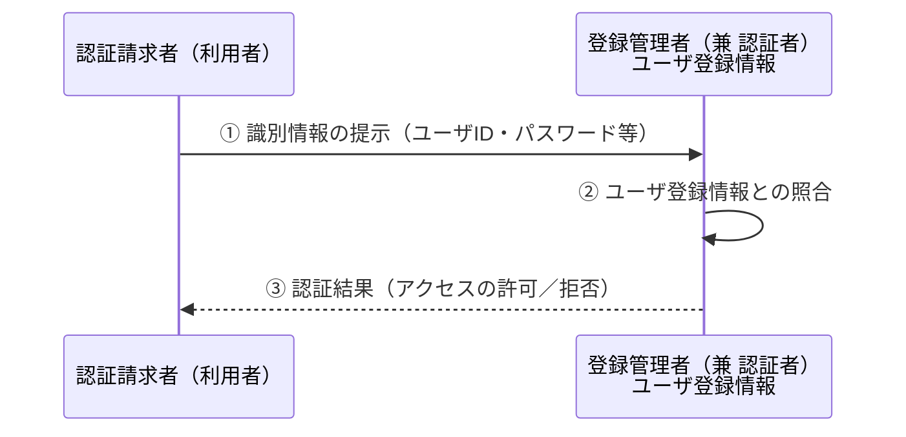
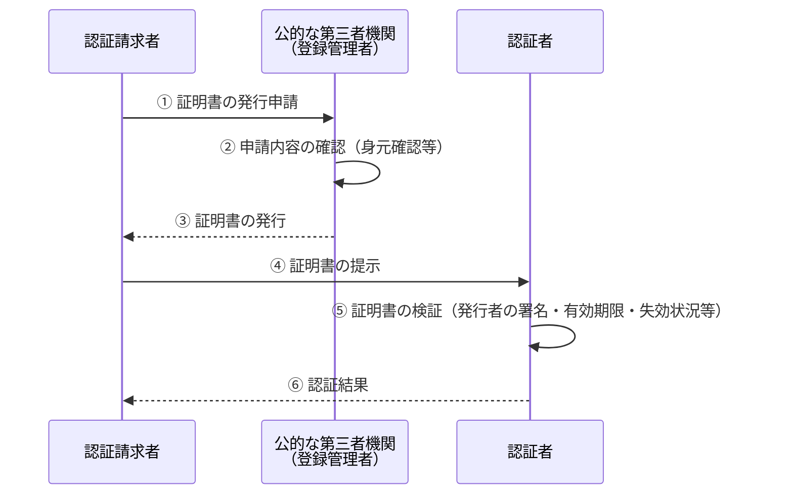
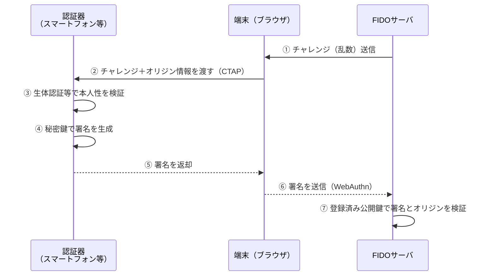

# 6-2_認証の基礎

## 6.2 認証の基礎

情報システムやネットワークを通じて顔の見えない相手とデータをやり取りしたり、サービスや物を提供あるいは購入したりするなどの取引を行う上で、認証は欠くことのできない重要な技術である。ここでは、認証の対象や手段など、基礎的な内容について解説する。

### 6.2.1 認証とは

認証とは、辞書の表現を引用すれば「一定の行為や文書の作成が正当な手続によってなされたことを、定められた公の機関が証明すること（出典：松村明編『大辞林 第二版』三省堂）」という意味である。一方、今日の情報セキュリティにおいて一般的に用いられている日本語の「認証」という言葉には、次のように英語の「Authentication」と「Certification」の二つの意味が含まれている。

#### Authentication

生体情報（Biometrics：バイオメトリクス）、ユーザID、パスワードなど、何らかの識別情報に基づいて人、物、情報を識別し、その正当性や真正性を直接確認することである。

通常は、情報資産やシステムリソースなどへのアクセス権を管理し、アクセス制御を行っているシステムや人間（登録管理者）と、それらに対するアクセスを要求する者（認証請求者）との間で、直接的に認証行為が行われる（登録管理者は認証者を兼ねる）。そのため、このような認証の方式を**二者間認証**という場合もある。

**図：二者間認証のイメージ**

#### Certification

デジタル証明書による認証に代表されるように、認証局などの信頼できる第三者（登録管理者）が発行する証明書の保有を基に、その持ち主の正当性を確認することである。つまり、この方式では認証請求者と認証者との間に第三者である登録管理者が介在し、それによって認証行為が行われる。このような認証方式を**三者間認証**という場合もある。

先に引用した辞書にある認証の意味に近いのはこちらであり、「ISMSの認証を取得する」などの「認証」もこちらの意味である。また、Certification は Authentication の手段の一つとしてとらえることもできる。

**図：三者間認証のイメージ**

> **ISMS認証（ISMS適合性評価制度）**
> 組織の情報セキュリティマネジメントシステム（ISMS）が国際規格 ISO/IEC 27001（JIS Q 27001）に適合していることを、第三者である認証機関が審査・証明する制度である。ここでいう「認証」は Certification の意味で用いられている。ISMSの構築や認証取得に関する事項は、情報セキュリティマネジメント試験などでも出題されている。

### 6.2.2 認証の分類

#### 認証の対象による分類

認証の対象、つまり認証を受けるものの種類によって、人の認証、物の認証、情報の認証の三つに大きく分類できる。

**表：認証の対象による分類**

| 認証の種類 | 内容 | 具体例 |
|---|---|---|
| 人の認証（本人認証） | 個人の識別を行い、事前に登録されている本人であることを確認すること | ユーザIDとパスワードによる本人認証、指紋による本人認証 |
| 物の認証 | システムやネットワークへのアクセスを要求している機器などの正当性を確認すること | MACアドレスによる端末の認証、製造番号による端末の認証 |
| 情報の認証（メッセージ認証） | 情報が不正に改変されていないことを確認すること | メッセージダイジェストやデジタル署名を用いた、プログラムやデータの改ざんの検知 |

#### 本人認証の手段と特徴による分類

本人認証は、どのような手段で個人を識別するかによって、次の表の三つに分類できる。

**表：本人認証の手段と特徴**

| 認証の種類 | 具体例 | メリット | デメリット |
|---|---|---|---|
| バイオメトリクスによる認証（生体認証） | 指紋、顔、掌形、虹彩、声紋、筆跡 | 本人以外を本人と誤認識する確率が非常に低い | 導入コストが高くなる場合がある。体調や環境の変化によって本人を本人と認識しない（本人拒否）場合がある。方式により測定精度に差がある |
| 所有物による認証 | 印鑑証明、ICカード、磁気カード、デジタル証明書 | 所有物がしっかり管理されてさえいれば簡便で安全 | 紛失・盗難のおそれがある。貸し借り、複製（偽造）のおそれもある |
| 記憶や秘密による認証 | パスワード、暗証番号、生年月日、住所 | 設置や設定にかかるコストが低く簡便 | 忘却のおそれがある。推測や辞書攻撃などで破られる可能性がある |

> **本人拒否率と他人受入率**
> バイオメトリクス認証の精度は、本人を誤って拒否する割合である本人拒否率（FRR：False Rejection Rate）と、他人を誤って受け入れる割合である他人受入率（FAR：False Acceptance Rate）で評価される。両者はトレードオフの関係にあり、照合のしきい値を厳しくするとFARは下がるがFRRは上がる。

所有物による認証は、主に物理環境における入退室管理システムなどで広く用いられている。一方、秘密による認証は、情報システムへのログインなどで最も広く用いられている。また、より高い安全性が求められる場面では、バイオメトリクスによる認証（生体認証）が用いられることが多い。

#### 多要素認証

所有物による認証と秘密による認証を併用する方法の典型的な例として、キャッシュカード（所有物）と暗証番号（秘密）によって本人認証を行い、銀行からお金を引き出すシステムがある。このように、複数の要素を組み合わせて認証を行う方式を**二要素認証**（Two Factor Authentication：2FA）、もしくは**多要素認証**（Multi Factor Authentication：MFA）という。

> **認証の三要素**
> 本人認証に用いる要素は、一般に「知識要素（Something You Know：パスワード等）」「所有要素（Something You Have：ICカード、スマートフォン等）」「生体要素（Something You Are：指紋、顔等）」の三つに整理される。パスワードと秘密の質問のように、同じ要素を二つ重ねても多要素認証にはならない点に注意が必要である。

#### 端末情報の照合と二段階認証

今日、インターネットで提供される各種会員向けサービスや商用サイト、SNSサイトなどでは、本人認証の強度を高めるため、端末情報の照合や二段階認証が広く普及している。

**端末情報の照合**は、ユーザが通常使用する端末の識別情報、位置情報などを登録しておき、それとは異なる端末や場所からの利用があった場合にそれを通知することで、アカウントが不正利用された可能性があることをユーザに注意喚起する仕組みである。一方、LINEのように、登録された1台の端末以外は一切サービスを利用できないように制限しているものもある。

**二段階認証**は、ユーザIDとパスワードで1回目の認証を行った後、登録されている端末にショートメッセージサービス（SMS）で数字4～6桁の認証コードが送られ、それを入力することで2回目の認証を行い、認証が完了するという方式が一般的である。この方式では、認証プロセスにおいて本人のスマートフォンや携帯電話（所有物）が必要となることから、多要素認証ともなっている。スマートフォンや携帯電話を用いずに、あらかじめ登録されているアドレスに電子メールで認証コードを送信する方式などもある。

> **二経路認証**
> スマートフォンのSMSなどを用いた二段階認証のように、インターネット上のログイン経路とは別の通信経路を併用して認証を行う方式を、二経路認証（アウトオブバンド認証）という。二つの経路を同時に乗っ取ることは難しいため、安全性が高まる。ただし、SIMスワップやフィッシングサイトによるリアルタイムの中継などの攻撃手法も知られており、万能ではない。

#### 3Dセキュア

ネットショッピング等でクレジットカード決済を行う際に、クレジットカード発行会社にあらかじめ登録したパスワードなど、本人しか分からない情報を入力させることにより、なりすましによるクレジットカードの不正使用を防止する仕組みを**3Dセキュア**という。国際ブランド各社が採用する本人認証サービスであり、現在は、リスクベース認証の考え方を取り入れ、リスクが高いと判定された取引に限って追加認証を求める「3Dセキュア2.0（EMV 3-Dセキュア）」への移行が進んでいる。

#### リスクベース認証

**リスクベース認証**とは、ユーザがログインする際のOSやブラウザ等の端末情報、IPアドレス、アクセス時間等の情報を基に、本人認証を行う認証方式である。

リスクベース認証では、ユーザがログインを試行すると、基本的な認証情報の確認に加え、上記のようなユーザのシステム環境等の確認がバックグラウンドで行われ、リスクが判定される。その結果、通常どおりのログイン試行であれば特別な操作等は必要なく、そのままログインできる。一方、通常と異なる場合にはリスクがあると判定され、秘密の質問等の追加情報の入力が求められる。リスクベース認証により、ユーザに負担をかけることなく認証を強化することが可能となる。

なお、このようにユーザの操作を必要としない認証方式を**パッシブ認証**、ユーザの操作を必要とする認証方式を**アクティブ認証**という。

#### パスワードを使用しない認証方式 FIDO 及び FIDO2

近年、パスワードを使用しない認証方式として、**FIDO**（Fast IDentity Online）が普及している。FIDOは、業界団体 FIDO Alliance によって規格の策定と普及活動が行われている。

FIDOは、生体認証による簡便でセキュアなオンライン認証基盤を実現する技術であり、次のような認証モデルを採用している。

- 利用者の手元にあるスマートフォン等のデバイスが認証器（Authenticator）となり、利用者の本人性を検証する
- 本人性の検証結果が認証サーバに送付され、認証サーバは検証結果の妥当性を確認することで認証が完結する
- ネットワーク上に利用者の認証情報は流さない
- 利用者の認証情報は利用者のデバイス内に保存し、サーバには保存しない（端末とサーバとで秘密を共有しない）

> **参考**
> FIDOアライアンス 日本 Working Group「パスワードのいらない世界へ ～FIDO認証の最新状況～」
> FIDO Alliance 公式サイト：https://fidoalliance.org/

FIDOを実現する技術として、**UAF**（Universal Authentication Framework：汎用的な認証フレームワーク）と**U2F**（Universal 2nd Factor：汎用的な第二要素）という2つの仕様が公開されている。

- **UAF**：FIDOに対応したデバイスを利用することで、パスワードを使用せずに認証を行う仕様である。デバイス上で生体認証等により本人性を検証し、デバイス内に保存された秘密鍵でデジタル署名を生成して認証サーバに送信する。サーバは登録済みの公開鍵で署名を検証する。
- **U2F**：二段階認証に関する仕様であり、1回目のパスワード認証の後、セキュリティキー（USBトークン等）を用いて2回目の認証を行う。

そして、UAFとU2Fを統合し、拡張した新規格として、2018年に**FIDO2**が制定された。FIDO2は、次の2つの技術仕様で構成されている。

- WebAuthn（Web Authentication）
- CTAP（Client To Authenticator Protocol）

**WebAuthn**は、端末（ブラウザ）とFIDOサーバがWebアプリケーションによって認証を行うためのWeb APIの仕様を規定したものである。**CTAP**は、端末と、認証器（Authenticator）と呼ばれるデバイスとの間の通信プロトコルを規定したものであり、USB、NFC、BLE（Bluetooth Low Energy）などを介して外部の認証器を利用できる。

WebAuthnでは、認証器をあらかじめサーバに登録するとともに、サーバのドメイン名等を認証器に保存する。認証時には、サーバからのチャレンジに対して、認証器が利用者の生体認証を行い、署名を生成してサーバに送信する。このとき、アクセス先のサーバのオリジン（プロトコル、ドメイン名、ポート番号）や署名の正当性が確認される。そのため、利用者が攻撃者の偽サイトに誘導されても認証は成立せず、また、攻撃者が認証情報を盗んで悪用することもできない。

**図：FIDO2（WebAuthn）による認証の流れ**

なお、WebAuthnは、W3C（World Wide Web Consortium）によってWeb標準規格として勧告されており、現在利用されている多くのブラウザ等に実装されている。

> **FIDO認証とパスキー**
> 近年は、FIDO2の認証資格情報（秘密鍵）をクラウド経由で複数のデバイス間で同期できるようにした「パスキー（Passkeys）」が、主要なOSやブラウザで利用可能となっている。これにより、機種変更時の再登録の手間などが軽減されている。

> **試験での出題**
> 情報処理安全確保支援士試験の午後問題では、FIDO2やWebAuthnによる認証方式、デジタル証明書の検証、Certificate Transparency（証明書の透明性）等に関する出題例がある。仕組みの流れを図とともに理解しておくとよい。

#### Column：CAPTCHA（キャプチャ）

CAPTCHAとは、"Completely Automated Public Turing test to tell Computers and Humans Apart" の略であり、「コンピュータと人間を判別するための完全に自動化された公開チューリングテスト」と訳される。

CAPTCHAは、会員登録・問合せなどのWebページにおいて、人間以外（プログラムによる自動操作、いわゆるボット）のリクエストを排除するために用いられる。代表的な方式として、ゆがめたり背景にノイズを加えたりした文字列の画像を表示して読み取らせるもの、条件に合う画像を複数の中から選択させるもの、スライダーやパズルを操作させるものなどがある。また、視覚障害者等への配慮として、音声を聞き取らせる方式も用意されていることが多い。

これにより、ボットによるアカウントの大量取得、スパムの投稿、パスワードリスト攻撃などの自動化された不正行為を抑止できる。ただし、画像認識技術の進歩によってCAPTCHAが機械的に突破される事例や、人手を使って大量に解読させる手口も存在する。そのため、Googleの reCAPTCHA v3 のように、ユーザの操作履歴や振る舞いを基にバックグラウンドでスコアを算出する、パッシブ認証型の方式も利用されている。

### Check!

- [ ] 【Q1】認証にはどのような種類があるか。
- [ ] 【Q2】本人認証の手段によるメリット・デメリットとしては何があるか。
- [ ] 【Q3】端末情報の照合はユーザにとってはどのような利点があるか。
- [ ] 【Q4】二要素認証（多要素認証）、二段階認証について説明せよ。
- [ ] 【Q5】リスクベース認証とは何か。
- [ ] 【Q6】FIDO及びFIDO2について説明せよ。
- [ ] 【Q7】CAPTCHAについて説明せよ。

### 確認問題

#### 問1

リスクベース認証の特徴はどれか。

- ア　いかなる環境からの認証の要求においても認証方法を変更せずに、同一の手順によって普段どおりにシステムが利用できる。
- イ　ハードウェアトークンとパスワードを併用させるなど、認証要求元の環境によらず、常に複数の認証方式を併用することによって、安全性を高める。
- ウ　普段と異なる環境からのアクセスと判断した場合、追加の本人認証をすることによって、不正アクセスに対抗し安全性を高める。
- エ　利用者が認証情報を忘れ、かつ、Webブラウザに保存しているパスワード情報も使用できない場合でも、救済することによって、利用者は普段どおりにシステムを利用できる。

［情報処理技術者試験 高度共通・H31春・午前Ⅰ］

**解答・解説**

リスクベース認証とは、送信元IPアドレスなど利用者の環境を分析し、普段とは異なるネットワークや端末からのアクセスであった場合に、追加で利用者に関する登録情報（秘密の質問の答えなど）を入力させて認証を行うことである。したがって、**ウ**が正解。

- ア：環境に応じて認証方法を変えないため、リスクベース認証の特徴ではない。
- イ：環境によらず常に複数の認証方式を併用するのは、多要素認証の説明である。
- エ：パスワードを忘れた場合のアカウント回復（リカバリ）に関する説明である。

#### 問2

3Dセキュアは、ネットショッピングでのオンライン決済におけるクレジットカードの不正使用を防止する対策の一つである。3Dセキュアに関する記述のうち、適切なものはどれか。

- ア　クレジットカードのPIN（Personal Identification Number：暗証番号）を入力させ、検証することによって、なりすましによる不正使用を防止する。
- イ　クレジットカードのセキュリティコード（カードの裏面又は表面に記載された3桁又は4桁の番号）を入力させ、検証することによって、クレジットカードの不正使用を防止する。
- ウ　クレジットカードの有効期限を入力させ、検証することによって、期限切れのクレジットカードの不正使用を防止する。
- エ　クレジットカード発行会社にあらかじめ登録したパスワードなど、本人しか分からない情報を入力させ、検証することによって、なりすましによるクレジットカードの不正使用を防止する。

［情報処理安全確保支援士試験・午前Ⅱ］

**解答・解説**

3Dセキュアは、ネットショッピング等でクレジットカード決済を行う際に、クレジットカード発行会社にあらかじめ登録したパスワードなど、本人しか分からない情報を入力させることにより、本人認証を行う仕組みである。したがって、**エ**が正解。

- ア：PINは主に対面決済（ICカード決済端末）で用いられる暗証番号であり、3Dセキュアの説明ではない。
- イ：セキュリティコードはカード券面に記載されているため、カード自体を盗まれたり券面情報を盗み見られたりした場合には効果が限られる。3Dセキュアとは別の対策である。
- ウ：有効期限の確認は通常の決済処理で行われるものであり、3Dセキュアの説明ではない。

#### 問3

認証処理のうち、FIDO（Fast IDentity Online）UAF（Universal Authentication Framework）1.1に基づいたものはどれか。

- ア　SaaS接続時の認証において、PINコードとトークンが表示したワンタイムパスワードとをPCから認証サーバに送信した。
- イ　SaaS接続時の認証において、スマートフォンで顔認証を行った後、スマートフォン内の秘密鍵でデジタル署名を生成して、そのデジタル署名を認証サーバに送信した。
- ウ　インターネットバンキング接続時の認証において、PCに接続されたカードリーダを使って、利用者のキャッシュカードからクライアント証明書を読み取って、そのクライアント証明書を認証サーバに送信した。
- エ　インターネットバンキング接続時の認証において、スマートフォンを使い指紋情報を読み取って、その指紋情報を認証サーバに送信した。

［情報処理安全確保支援士試験・R元秋・午前Ⅱ］

**解答・解説**

FIDOは、パスワードを使用しない認証方式として、業界団体 FIDO Alliance によって規格の策定と普及活動が行われている。FIDOは、生体認証による簡便でセキュアなオンライン認証基盤を実現する技術であり、次のような認証モデルを採用している。

- 利用者の手元にあるスマートフォンなどのデバイスが認証器（Authenticator）となり、利用者の本人性を検証する
- 本人性の検証結果が認証サーバに送付され、認証サーバは検証結果の妥当性を確認することで認証が完結する
- ネットワーク上に利用者の認証情報は流さない
- 利用者の認証情報は利用者のデバイス内に保存し、サーバには保存しない（端末とサーバとで秘密を共有しない）

FIDOを実現する技術として、UAF（Universal Authentication Framework：汎用的な認証フレームワーク）とU2F（Universal 2nd Factor：汎用的な第二要素）という2つの仕様が公開されている。UAFは、FIDOに対応したデバイスを利用することで、パスワードを使用せずに認証を行う仕様である。U2Fは二段階認証に関する仕様であり、1回目の認証後、セキュリティコードやセキュリティキーを用いて2回目の認証を行う。

解答群の中でFIDO UAFに該当するのは、デバイス上で生体認証を行い、デバイス内の秘密鍵で生成したデジタル署名のみをサーバに送信している**イ**である。

- ア：PINコードとワンタイムパスワードによる二要素認証であり、FIDO UAFではない。
- ウ：クライアント証明書を用いたPKIベースの認証であり、FIDO UAFではない。
- エ：指紋情報（生体情報そのもの）をネットワーク経由でサーバに送信しており、「ネットワーク上に利用者の認証情報は流さない」というFIDOの原則に反する。