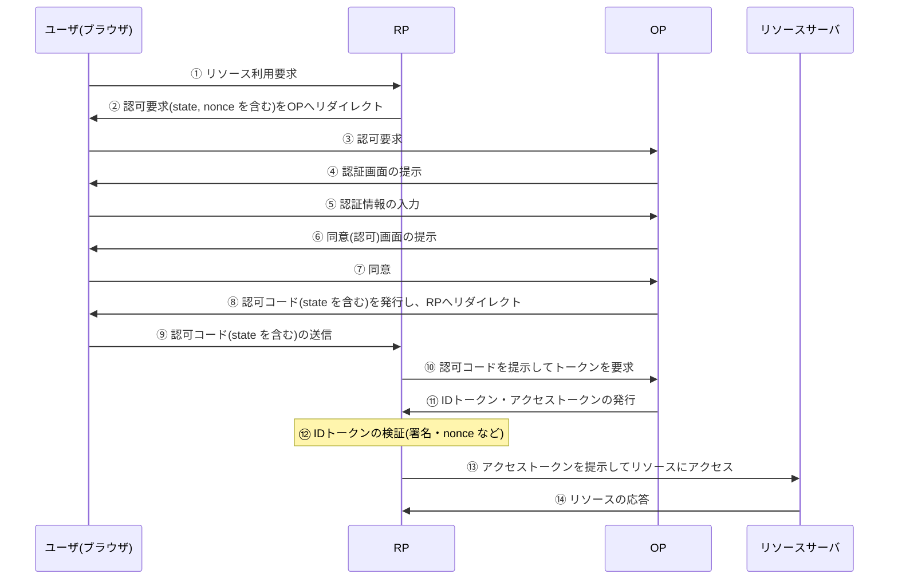

# 情報セキュリティ対策技術 (2) アクセス制御と認証

## 6.9 ID連携技術

近年、ID連携技術が広く普及している。ここでは、ID連携の業界標準仕様である OAuth と OpenID Connect について解説する。

### 6.9.1 ID連携の概要

ID連携とは、他の会員向けサービスなどに登録されているIDを自社の会員向けWebサイトやアプリケーションサービスなどに連携し、ログインを可能とする仕組みである。多くのユーザがIDを登録している大手ポータルサイトやSNS(Social Networking Service)を IdP(Identity Provider)として連携させれば、自社のサービスで会員のクレデンシャル情報を独自に登録・管理しなくても、サービスを提供できる。

> **クレデンシャル(credential)**
> ユーザID、パスワード、メールアドレス、生体情報など、利用者の識別・認証に用いられる情報の総称。クレデンシャル情報を自社で保持しなければ、その漏えいリスクや管理負担を軽減できる。

#### ① 主なID連携技術

##### ● OAuth と OpenID Connect

ID連携の主な技術仕様として、**OAuth 2.0**(RFC 6749)と **OpenID Connect Core 1.0** がある。

OAuth 2.0 は、サードパーティアプリケーションによるWebサービスへの限定的なアクセスを可能にする**認可フレームワーク**である。信頼関係にある複数のサービス間で、認可情報をセキュアにやり取りする仕組み(API)を提供する。なお、OAuth 2.0 自体は認証を行わない。

OAuth 2.0 では、各構成要素を次のように呼ぶ。

| 名称 | 役割 |
|---|---|
| リソースサーバ | OAuth 2.0 のAPIを提供しているサービス |
| クライアント | リソースサーバが提供するAPIを利用するサービス |
| リソースオーナー | 認可情報を付与する利用者 |
| 認可サーバ | リソースオーナーの許可を得て、クライアントにアクセストークンを発行するサーバ |

> **試験に出る**
> 情報処理安全確保支援士試験の令和3年度の午後試験 問1で、OAuth 2.0 を用いた認可システムのセキュリティ対策に関する問題が出題された。

**OpenID Connect Core 1.0** は、OAuth 2.0 をベースに、IDトークンを用いてユーザを認証する仕組みを追加したものである。つまり、OpenID Connect は認証と認可の両方を行う。

OpenID Connect Core 1.0 における主な用語を次に示す。

**表:OpenID Connect Core 1.0 における主な用語**

| 用語 | 概要 |
|---|---|
| OpenID Provider(OP) | ユーザを識別・認証し、RPからの要求を受けてIDトークン、アクセストークンを発行する |
| Relying Party(RP) | ユーザからのリソース利用要求を受け、OPに対してアクセストークンとIDトークンの発行を要求する |
| IDトークン | ユーザ認証情報を含む、署名付き JSON Web Token(JWT)形式のトークン |
| アクセストークン | リソースサーバにアクセスするためのトークン |
| リソースサーバ | リソースへのアクセス要求に応答するサーバ |

> **JWT(JSON Web Token)**
> JSON形式のデータに電子署名を付与してトークン化する仕様(RFC 7519)。IDトークンには、発行者(iss)、対象者(sub)、受信者(aud)、有効期限(exp)、nonce などの情報(クレーム)が含まれる。RPは署名とこれらのクレームを検証して、トークンの正当性を確認する。

##### ● OpenID Connect における認可シーケンス

OpenID Connect Core 1.0 では、アクセストークンを発行する手段として、次の四つの認可シーケンス(グラントタイプ)を定義している。

- Authorization Code Grant(認可コードグラント)
- Implicit Grant(インプリシットグラント)
- Resource Owner Password Credentials Grant(リソースオーナーパスワードクレデンシャルグラント)
- Client Credentials Grant(クライアントクレデンシャルグラント)

> **試験に出る**
> 情報処理安全確保支援士試験の午後試験 問2で、OpenID Connect を利用したサービス間の連携に関する問題が出題された。

これらのうち、広く実装されている Authorization Code Grant の認可シーケンスを次に示す。

**図:Authorization Code Grant の認可シーケンス**

攻撃者などの第三者がこのシーケンスに介在すると、ユーザが意図しないままリソースサーバにアクセスさせられるおそれがある(CSRF攻撃)。これを防ぐため、RFC 6749 では推測困難な **stateパラメータ**の利用を推奨している。stateパラメータは、②の認可要求時にRPから送付され、⑨でユーザが認可コードを送信する際にそのままRPに返される。RPは、受信したstateパラメータを自らが送付した値と照合し、当該セッションが正常であることを確認する。

また、攻撃者によるIDトークンの不正利用(リプレイ攻撃)を防ぐため、**nonce値**も用いられる。nonce値は、②でRPから送付された後、⑪でOPが発行するIDトークンに含められる。RPは、IDトークン内のnonce値が②で送付した値と一致することを検証し(⑫)、IDトークンが当該セッションのために発行されたものであることを確認する。

さらに、認可コードの横取り攻撃への対策として、**PKCE**(Proof Key for Code Exchange、「ピクシー」と読む)が用いられる。PKCEは、スマートフォンアプリなど、クライアントシークレットを安全に保持できないパブリッククライアント向けに設計された OAuth 2.0 の拡張仕様であり、RFC 7636 に "Proof Key for Code Exchange by OAuth Public Clients" として定義されている。

> **PKCE の仕組み**
> クライアントは、認可要求ごとにランダムな文字列(code_verifier)を生成する。認可要求時には、そのハッシュ値(code_challenge)を送付する。トークン要求時には code_verifier そのものを送付し、認可サーバは両者の対応関係を検証する。攻撃者が認可コードを横取りしても、code_verifier を知らなければトークンを取得できない。

### ◆ Check!

- [ ] 【Q1】ID連携とは何か。
- [ ] 【Q2】OAuth と OpenID Connect について説明せよ。

> **解答例**
> 【Q1】他のサービスに登録されているIDを自社のWebサイトやアプリケーションサービスなどと連携させ、ログインを可能にする仕組みである。
> 【Q2】OAuth 2.0 は、複数のサービス間で認可情報をセキュアにやり取りする認可フレームワークであり、認証は行わない。OpenID Connect は、OAuth 2.0 にIDトークンによる認証の仕組みを追加したもので、認証と認可の両方を行う。

### 確認問題 1

OAuth 2.0 に関する記述のうち、適切なものはどれか。

- ア 認可を行うためのプロトコルであり、認可サーバが、アクセスしてきた者が利用者(リソースオーナー)本人であるかどうかを確認するためのものである。
- イ 認可を行うためのプロトコルであり、認可サーバが、利用者(リソースオーナー)の許可を得て、サービス(クライアント)に対し、適切な権限を付与するためのものである。
- ウ 認証を行うためのプロトコルであり、認証サーバが、アクセスしてきた者が利用者(リソースオーナー)本人であるかどうかを確認するためのものである。
- エ 認証を行うためのプロトコルであり、認証サーバが、利用者(リソースオーナー)の許可を得て、サービス(クライアント)に対し、適切な権限を付与するためのものである。

[情報処理安全確保支援士試験・R5・午前Ⅱ]

#### ● 解答・解説

OAuth 2.0 は、信頼関係にある複数のサービス間で認可情報をセキュアにやり取りする仕組み(API)を提供する。

OAuth 2.0 のAPIを提供しているサービスを「リソースサーバ」、リソースサーバが提供するAPIを利用するサービスを「クライアント」と呼ぶ。また、認可情報を付与する利用者を「リソースオーナー」、リソースオーナーの許可を得てクライアントにアクセストークンを発行し、権限を付与するサーバを「認可サーバ」と呼ぶ。

ア・ウは本人確認、すなわち認証の説明であり、OAuth 2.0 の目的ではない。エは「認証を行うためのプロトコル」としている点が誤りである。したがって、**イ**が正解。

### 確認問題 2

特定の利用者が所有するリソースが、WebサービスA上にある。OAuth 2.0 において、利用者の認可の下、WebサービスBからそのリソースへの限定されたアクセスを可能にするためのプロトコルの動作はどれか。

- ア WebサービスAが、アクセストークンを発行する。
- イ WebサービスAが、利用者のデジタル証明書をWebサービスBに送信する。
- ウ WebサービスBが、アクセストークンを発行する。
- エ WebサービスBが、利用者のデジタル証明書をWebサービスAに送信する。

[情報処理安全確保支援士試験・H29春・午前Ⅱ]

#### ● 解答・解説

OAuth 2.0 は、信頼関係にある複数のサービス間で認可情報をセキュアにやり取りする仕組みを提供する。OAuth 2.0 では、利用者の認可の下で、リソースを保有する側であるWebサービスA(リソースサーバ・認可サーバ側)が、クライアントであるWebサービスBに対してアクセストークンを発行する。WebサービスBは、このアクセストークンを用いてWebサービスA上のリソースに限定的にアクセスする。

イ・エのように、デジタル証明書の送受信によって認可を行う仕組みではない。したがって、**ア**が正解。